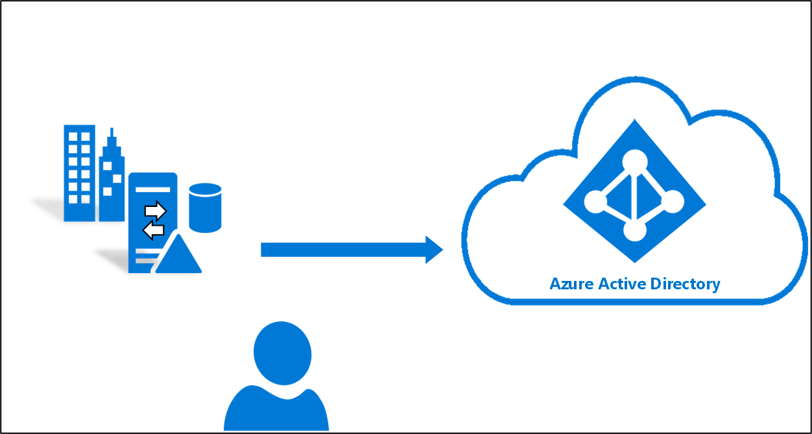

# ¿Qué es la sincronización en la nube de Azure AD Connect?
La sincronización en la nube de Azure AD Connect es una nueva oferta de Microsoft que se ha concebido para cumplir los objetivos de identidad híbrida con fines de sincronización de usuarios, grupos y contactos en Azure AD.  Para ello, se usa el agente de aprovisionamiento de Azure AD en la nube, en lugar de la aplicación Azure AD Connect.  No obstante, se puede usar junto con la sincronización de Azure AD Connect y ofrece las siguientes ventajas:
    
- Compatibilidad con la sincronización con un inquilino de Azure AD desde un entorno de varios bosques de Active Directory desconectado: Entre los escenarios comunes se incluyen la fusión y adquisición, donde los bosques de AD de la empresa adquirida están aislados de los bosques de AD de la empresa matriz, y empresas que históricamente tenían varios bosques de AD.
- Instalación simplificada con agentes de aprovisionamiento ligeros: Los agentes actúan como un puente de AD a Azure AD, con toda la configuración de sincronización administrada en la nube. 
- Se pueden usar varios agentes de aprovisionamiento para simplificar las implementaciones de alta disponibilidad, especialmente críticas para las organizaciones que dependen de la sincronización de hash de contraseñas de AD a Azure AD.
- Compatibilidad con grupos grandes que tengan un máximo de 50 000 miembros. Se recomienda usar únicamente el filtro de ámbito de la unidad organizativa para sincronizar grupos grandes.

## ¿En qué se diferencian el aprovisionamiento en la nube de Azure AD Connect y la sincronización de Azure AD Connect?
Con el aprovisionamiento en la nube de Azure AD Connect, el aprovisionamiento de AD a Azure AD se organiza en Microsoft Online Services. Una organización solo tiene que implementar en su entorno local y hospedado en IaaS un agente ligero que actúa como puente entre Azure AD y AD. La configuración de aprovisionamiento se almacena en Azure AD y se administra como parte del servicio.

## Vídeo sobre la sincronización en la nube de Azure AD Connect
El siguiente vídeo breve ofrece una excelente introducción a la sincronización en la nube de Azure AD Connect:

> [!VIDEO https://youtube.com/embed/mOT3ID02_YQ]

## Comparación entre Azure AD Connect y el aprovisionamiento en la nube

En la tabla siguiente se proporciona una comparación entre Azure AD Connect y la sincronización en la nube de Azure AD Connect:

| Característica | Sincronización de Azure Active Directory Connect| Sincronización en la nube de Azure Active Directory Connect |
|:--- |:---:|:---:|
|Conexión a un bosque de AD local|● |● |
| Conexión a varios bosques de AD locales |● |● |
| Conexión a varios bosques de AD locales desconectados | |● |
| Modelo de instalación de agente ligero | |● |
| Varios agentes activos para alta disponibilidad | |● |
| Conexión a directorios LDAP|●| | 
| Compatibilidad con objetos de usuario |● |● |
| Compatibilidad con objetos de grupo |● |● |
| Compatibilidad con objetos de contacto |● |● |
| Compatibilidad con objetos de dispositivo |● | |
| Permitir personalización básica para flujos de atributo |● |● |
| Sincronizar atributos de Exchange en línea |● |● |
| Sincronizar atributos de extensión 1-15 |● |● |
| Sincronización de atributos de AD definidos por el cliente (extensiones de directorio) |● | |
| Compatibilidad con la sincronización de hash de contraseñas |●|●|
| Compatibilidad con la autenticación de paso a través |●||
| Compatibilidad con la federación |●|●|
| Inicio de sesión único de conexión directa|● |●|
| Admite la instalación de un controlador de dominio |● |● |
| Compatibilidad con Windows Server 2012 y Windows Server 2012 R2 |● |● |
| Filtrar por dominios/unidades organizativas/grupos |● |● |
| Filtrar según valores de atributo de los objetos |● | |
| Permitir sincronización de un conjunto mínimo de atributos (MinSync) |● |● |
| Permitir quitar atributos del flujo de AD a Azure AD |● |● |
| Permitir personalización avanzada para flujos de atributo |● | |
| Compatibilidad con la escritura diferida (contraseñas, dispositivos, grupos) |● | |
| Compatibilidad con Azure AD Domain Services|● | |
| [Reescritura híbrida de Exchange](../hybrid/reference-connect-sync-attributes-synchronized.md#exchange-hybrid-writeback) |● | |
| Compatibilidad con hasta 150 000 objetos por dominio de AD |● |● |
| Compatibilidad con grupos grandes: grupos con hasta 50 000 miembros |● |● |
| Referencias entre dominios|● | |
| Aprovisionamiento a petición| |● |

## Pasos siguientes 

- [¿Qué es el aprovisionamiento?](what-is-provisioning.md)
- [Instalación de la sincronización en la nube](how-to-install.md)
