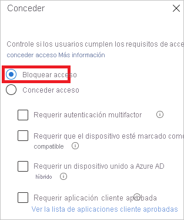
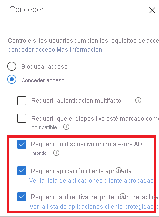
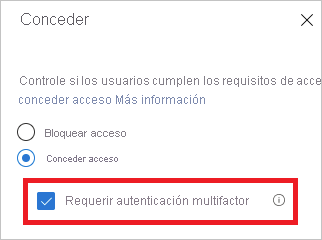

# ¿Qué es el diagnóstico de inicio de sesión en Azure AD?

Azure Active Directory (Azure AD) proporciona un modelo de seguridad flexible para controlar qué pueden hacer los usuarios con los recursos administrados. El acceso a estos recursos no solo lo controla *quién* accede a ellos, sino también *cómo* se accede a ellos. Normalmente, un modelo flexible conlleva un cierto grado de complejidad debido al número de opciones de configuración que tiene. La complejidad hace que pueda aumentar el riesgo de errores.

Como administrador de TI, necesita una solución que le ofrezca una perspectiva de las actividades del sistema. Esta visibilidad puede permitirle diagnosticar y resolver los problemas cuando se produzcan. El diagnóstico de inicio de sesión de Azure AD es un ejemplo de este tipo de solución. Puede usarlo para analizar lo que ha sucedido durante un intento de inicio de sesión y obtener recomendaciones para solucionar problemas sin necesidad de que intervenga el servicio de soporte técnico de Microsoft.

En este artículo se proporciona información general no solo sobre las funciones de la solución, sino también sobre cómo se puede usar.

## Requisitos

El diagnóstico del inicio de sesión está disponible en todas las ediciones de Azure AD.

Para usarlo, es preciso ser administrador global de Azure AD.

## Funcionamiento

En Azure AD, la respuesta a un intento de inicio de sesión está ligada a *quién* inicia sesión y *cómo* se accede al inquilino. Por ejemplo, un administrador normalmente puede configurar todos los aspectos del inquilino cuando inicia sesión desde la red corporativa. Sin embargo, el mismo usuario podría estar bloqueado cuando inicia sesión con la misma cuenta desde una red que no es de confianza.

Dada la mayor flexibilidad del sistema para responder a un intento de inicio de sesión, podrían acabar en escenarios en los que tengan que solucionar problemas de inicio de sesión. El diagnóstico de inicio de sesión es una característica que:

- Analiza los datos de los eventos de inicio de sesión.

- Muestra lo que ha sucedido.

- Proporciona recomendaciones sobre cómo resolver los problemas.

El diagnóstico de inicio de sesión de Azure AD está diseñado para habilitar el diagnóstico automático de errores en el inicio de sesión. Para completar el proceso de diagnóstico, es preciso:

1. Definir el ámbito de los eventos de inicio de sesión que le interesan.

2. Seleccionar el inicio de sesión que se quiere revisar.

3. Examinar el resultado del diagnóstico.

4. Emprender acciones.

### Definición del ámbito

El objetivo de este paso es definir el ámbito de los eventos de inicio de sesión que se van a investigar. Dicho ámbito se basa en un usuario o un identificador (correlationId, requestId) y en un intervalo de tiempo. Para reducir aún más el ámbito, puede especificar un nombre de aplicación. Azure AD usa la información del ámbito para buscar los eventos adecuados.  

### Selección de inicio de sesión  

En función de los criterios de búsqueda, Azure AD recupera todos los eventos de inicio de sesión coincidentes y los presenta en una vista de lista de resumen de autenticación.

Las columnas que se muestran en esta vista se pueden personalizar.

### Revisión del diagnóstico

Azure AD proporciona los resultados de diagnóstico del evento de inicio de sesión seleccionado.

Estos resultados comienzan con una evaluación, que explica lo que sucedió en unas cuentas oraciones. Dicha explicación le ayuda a comprender el comportamiento del sistema.

A continuación, recibirá un resumen de las directivas de acceso condicional relacionadas que se aplicaron al inicio de sesión seleccionado. Los resultados de diagnóstico también incluyen los pasos de corrección recomendados para resolver el problema. Como no siempre es posible resolver problemas sin ayuda adicional, un paso recomendado podría ser abrir una incidencia de soporte técnico.

### Realizar acción

En este momento, debe tener la información necesaria para corregir el problema.

## Escenarios

Los siguientes escenarios están incluidos en el diagnóstico de inicio de sesión:

- Bloqueado por acceso condicional

- Acceso condicional con error

- Autenticación multifactor (MFA) del acceso condicional

- Autenticación multifactor de otros requisitos

- Se requiere una prueba de autenticación multifactor

- Prueba de MFA requerida (ubicación de inicio de sesión de riesgo)

- Inicio de sesión correcto

### Bloqueado por acceso condicional

En este escenario, una directiva de acceso condicional ha bloqueado un intento de inicio de sesión.

La sección de diagnóstico de este escenario muestra detalles sobre el evento de inicio de sesión del usuario y las directivas aplicadas.

### Acceso condicional con error

Este escenario suele ser el resultado de un error de intento de inicio de sesión debido a que no se cumplieron los requisitos de una directiva de acceso condicional. Los ejemplos comunes son:

- Requerir un dispositivo unido a Azure AD híbrido

- Requerir aplicación cliente aprobada

- Requerir la directiva de protección de aplicaciones

En la sección de diagnóstico de este escenario se muestran detalles sobre el intento de inicio de sesión del usuario y las directivas aplicadas.

### Autenticación multifactor de acceso condicional

En este escenario, una directiva de acceso condicional tiene el requisito de iniciar sesión con el conjunto de autenticación multifactor.

En la sección de diagnóstico de este escenario se muestran detalles sobre el intento de inicio de sesión del usuario y las directivas aplicadas.

### Autenticación multifactor de otros requisitos

En este escenario, una directiva de acceso condicional no aplicó un requisito de autenticación multifactor. Por ejemplo, la autenticación multifactor a cada usuario.

La intención de este escenario de diagnóstico es proporcionar más detalles sobre:

- El origen de la interrupción de la autenticación multifactor.
- El resultado de la interacción del cliente.

También puede ver todos los detalles del intento de inicio de sesión del usuario.

### Se requiere una prueba de autenticación multifactor

En este escenario, las solicitudes para configurar la autenticación multifactor interrumpieron los intentos de inicio de sesión. Esta configuración se conoce también como prueba.

La prueba de autenticación multifactor se produce cuando se exige a un usuario que utilice la autenticación multifactor, pero aún no se ha configurado, o un administrador ha solicitado al usuario que la configure.

La intención de este escenario de diagnóstico es revelar que la interrupción de la autenticación multifactor se debe a la falta de configuración del usuario. La solución recomendada es que el usuario realice la prueba.

### Prueba de MFA requerida (ubicación de inicio de sesión de riesgo)

En este escenario, los intentos de inicio de sesión se interrumpieron mediante una solicitud para configurar la autenticación multifactor a partir de una ubicación de inicio de sesión de riesgo.

La intención de este escenario de diagnóstico es revelar que la interrupción de la autenticación multifactor se debe a la falta de configuración del usuario. La solución recomendada es que el usuario realice la prueba, en concreto desde una ubicación de red que no parezca arriesgada.

Por ejemplo, si una red corporativa se define como una ubicación con nombre, el usuario debe intentar realizar la prueba desde la red corporativa.

### Inicio de sesión correcto

En este escenario, los eventos de inicio de sesión no se interrumpieron con el acceso condicional o la autenticación multifactor.

En este escenario de diagnóstico se proporcionan detalles sobre los eventos de inicio de sesión de usuario que se prevé que se interrumpan debido a las directivas de acceso condicional o a la autenticación multifactor.

## Pasos siguientes

- [¿Qué son los informes de Azure Active Directory?](overview-reports.md)
- [¿Qué es la supervisión de Azure Active Directory?](overview-monitoring.md)
