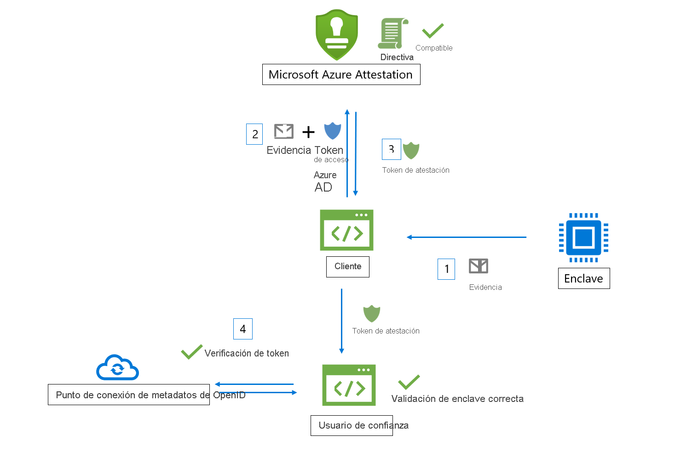
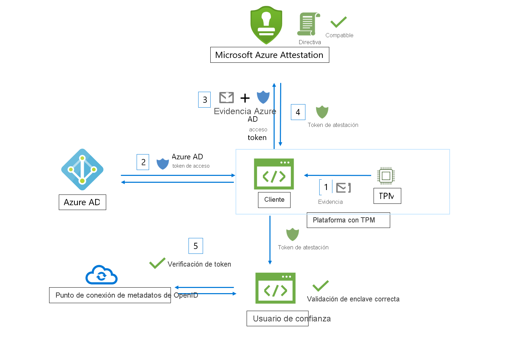

# Flujo de trabajo

Microsoft Azure Attestation recibe la evidencia de los enclaves y la evalúa con respecto a las directivas configurables y de base de referencia de seguridad de Azure. Tras una verificación correcta, Azure Attestation genera un token de atestación para confirmar la confiabilidad del enclave.

En el flujo de trabajo de Azure Attestation participan los siguientes actores:

- **Usuario de confianza**: componente que se basa en Azure Attestation para comprobar la validez del enclave. 
- **Cliente**: componente que recopila información de un enclave y envía solicitudes a Azure Attestation. 
- **Azure Attestation**: componente que acepta la evidencia de enclave del cliente, la valida y devuelve el token de atestación al cliente.

## Flujo de trabajo de validación del enclave Software Guard Extensions (SGX) de Intel®

Estos son los pasos generales de un flujo de trabajo típico de atestación de un enclave SGX (mediante Azure Attestation):

1. El cliente recopila la evidencia de un enclave. Esta evidencia consiste en información sobre el entorno del enclave y la biblioteca cliente que se ejecuta en el enclave.
1. El cliente tiene un URI que hace referencia a una instancia de Azure Attestation. El cliente envía evidencias a Azure Attestation. La información exacta que se envía al proveedor depende del tipo de enclave.
1. Azure Attestation valida la información enviada y la evalúa con respecto a una directiva configurada. Si la comprobación finaliza correctamente, Azure Attestation emite un token de atestación y lo devuelve al cliente. Si se produce un error en este paso, Azure Attestation notifica este error al cliente. 
1. El cliente envía el token de atestación al usuario de confianza. El usuario de confianza llama al punto de conexión de metadatos de clave pública de Azure Attestation para recuperar certificados de firma. Después, el usuario de confianza comprueba la firma del token de atestación y garantiza la confiabilidad del enclave. 

> [!Note]
> Cuando se envían solicitudes de atestación en la versión de API [2018-09-01-Preview](https://github.com/Azure/azure-rest-api-specs/tree/master/specification/attestation/data-plane/Microsoft.Attestation/stable/2018-09-01-preview), el cliente debe enviar evidencias a Azure Attestation junto con el token de acceso de Azure AD.

## Flujo de trabajo de validación del enclave del Módulo de plataforma segura (TPM)

Estos son los pasos generales de un flujo de trabajo típico de atestación de un enclave de TPM (mediante Azure Attestation):

1.  En el arranque del dispositivo o de la plataforma, varios cargadores de arranque y servicios de arranque miden los eventos a los que respalda el TPM y se almacenan de forma segura (registro de TCG).
2.  El cliente recopila los registros de TCG del dispositivo y la cita de TPM, que actúa como prueba para la atestación.
3.  El cliente tiene un URI que hace referencia a una instancia de Azure Attestation. El cliente envía evidencias a Azure Attestation. La información exacta que se envía al proveedor depende de la plataforma.
4.  Azure Attestation valida la información enviada y la evalúa con respecto a una directiva configurada. Si la comprobación finaliza correctamente, Azure Attestation emite un token de atestación y lo devuelve al cliente. Si se produce un error en este paso, Azure Attestation notifica este error al cliente. La comunicación entre el cliente y el servicio de atestación la dicta el protocolo TPM de atestación de Azure.
5.  Luego, el cliente envía el token de atestación al usuario de confianza. El usuario de confianza llama al punto de conexión de metadatos de clave pública de Azure Attestation para recuperar certificados de firma. Y, seguidamente, comprueba la firma del token de atestación y garantiza la confiabilidad del enclave.

## Pasos siguientes
- [Creación y firma de una directiva de atestación](author-sign-policy.md)
- [Configuración de Azure Attestation con PowerShell](quickstart-powershell.md)
