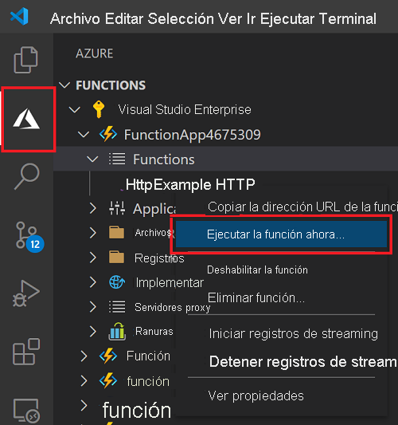

# Inicio rápido: Creación de una función de JavaScript con Visual Studio Code

> [!div class="op_single_selector" title1="Seleccione el lenguaje de la función: "]
> - [JavaScript](create-first-function-vs-code-node.md)
> - [C#](create-first-function-vs-code-csharp.md)
> - [Java](create-first-function-vs-code-java.md)
> - [PowerShell](create-first-function-vs-code-powershell.md)
> - [Python](create-first-function-vs-code-python.md)
> - [TypeScript](create-first-function-vs-code-typescript.md)
> - [Otro (Go/Rust)](create-first-function-vs-code-other.md)

Use Visual Studio Code para crear una función de JavaScript que responda a solicitudes HTTP. Pruebe el código localmente y, a continuación, impleméntelo en el entorno sin servidor de Azure Functions.

Si completa este inicio rápido, incurrirá en un pequeño costo de unos céntimos, o menos, en su <abbr title="La cuenta de Azure es una entidad única global que le proporciona acceso a los servicios de Azure y a las suscripciones de Azure.">Cuenta de Azure</abbr>.

## 1. Preparación del entorno

Antes de empezar, asegúrese de que cumple los siguientes requisitos:

+ Una cuenta de Azure con una <abbr title="Una suscripción de Azure es un contenedor lógico que se usa para aprovisionar recursos en Azure. Contiene los detalles de todos los recursos, como máquinas virtuales, bases de datos, etc.">suscripción activa</abbr>. [Cree una cuenta gratuita](https://azure.microsoft.com/free/?ref=microsoft.com&utm_source=microsoft.com&utm_medium=docs&utm_campaign=visualstudio).

+ [Node.js 10.14.1+](https://nodejs.org/)

+ [Visual Studio Code](https://code.visualstudio.com/)

+ [Extensión de Azure Functions](https://marketplace.visualstudio.com/items?itemName=ms-azuretools.vscode-azurefunctions) para Visual Studio Code.

+ [Azure Functions Core Tools](functions-run-local.md?tabs=linux%2Ccsharp%2Cbash#install-the-azure-functions-core-tools)

 

## 2. Creación de un proyecto local de Functions

1. Seleccione el icono de Azure en la <abbr title="">barra de actividades</abbr>y, a continuación, en el área **Azure: Functions**, seleccione el icono **Crear proyecto...**

    

1. **Elija una ubicación de directorio** para el área de trabajo del proyecto y, a continuación, **Seleccionar**. 

1. Escriba la siguiente información cuando se le indique:

    + **Seleccione un lenguaje para el proyecto de funciones**: Elija `JavaScript`.

    + **Seleccione una plantilla para la primera función del proyecto**: Elija `HTTP trigger`.

    + **Especifique un nombre de función**: Escriba `HttpExample`.

    + **Nivel de autorización**: Elija `Anonymous`, que permite que cualquier llame al punto de conexión de la función.

    + **Seleccione cómo desea que se abra el proyecto**: Elija `Add to workspace`.

 

<strong>¿No puede crear un proyecto de aplicación de funciones?</strong>

Entre los problemas más comunes que se pueden resolver al crear un proyecto local de aplicación de funciones, se incluyen los siguientes:
* No tener instalada la extensión de Azure Functions. 

 

## 3. Ejecución local de la función

1. Presione <kbd>F5</kbd> para iniciar el proyecto de aplicación de funciones. 

1. En el panel **Terminal**, observe el punto de conexión de la dirección URL de la función que se ejecuta localmente.

    

1. Copie la siguiente dirección URL, péguela en un explorador web y, a continuación, pulse Entrar.

    `http://localhost:7071/api/HttpExample?name=Functions`

1. Observe la respuesta devuelta.

    

1. Observe la información sobre la solicitud en el panel **Terminal**.

    

1. Presione <kbd>Ctrl + C</kbd> para detener Core Tools y desconectar el depurador.

 

<strong>¿No puede ejecutar la función localmente?</strong>

Entre los problemas más comunes que se pueden resolver al ejecutar un proyecto local de Functions, se incluyen los siguientes:
* No tener instalado el conjunto de herramientas Core Tools. 
*  Si tiene problemas de ejecución en Windows, asegúrese de que el shell de terminal predeterminado para Visual Studio Code no se haya establecido en WSL Bash. 

 

## 4. Inicio de sesión en Azure

Para publicar la aplicación, inicie sesión en Azure. Si ya ha iniciado sesión, vaya a la sección siguiente.

1. Seleccione el icono de Azure en la barra de actividades y, a continuación, en el área **Azure: Functions**, seleccione **Iniciar sesión en Azure...** .

    

1. Cuando se le solicite en el explorador, **elija su cuenta de Azure** e **inicie sesión** con sus credenciales.

1. Cuando haya iniciado sesión correctamente, cierre la nueva ventana del explorador y vuelva a Visual Studio Code. 

 

## 5. Publicar el proyecto en Azure

La primera implementación de código incluye crear un recurso de función en la suscripción de Azure. 

1. Seleccione el icono de Azure en la barra de actividades y después en el área **Azure: Functions**, seleccione el botón de **implementación en la aplicación de funciones**.

    

1. Escriba la siguiente información cuando se le indique:

    + **Select folder** (Seleccionar carpeta): Elija la carpeta que contiene la aplicación de funciones. 

    + **Seleccione la suscripción**: elija la suscripción que desee usar. No se mostrará esta opción si solo tiene una suscripción.

    + **Seleccione la aplicación de funciones en Azure**: Elija `+ Create new Function App`.

    + **Especifique un nombre único global para la aplicación de funciones**: escriba un nombre que sea único en Azure en una ruta de acceso URL. El nombre que escriba se valida para garantizar que sea único de forma global.

    + **Seleccione un entorno de ejecución**: Elija la versión de Node.js en la que se ha estado ejecutando localmente. Ejecute el comando `node --version` para comprobar la versión.

    + **Seleccione una ubicación para los nuevos recursos**:  Para mejorar el rendimiento, elija una [región](https://azure.microsoft.com/regions/) cerca de usted. 

1. Una vez que se haya creado la aplicación de función se mostrará una notificación y se aplicará el paquete de implementación. Seleccione **View Output** (Ver salida) para ver los resultados de la creación y la implementación. 
    
    

 

<strong>¿No puede publicar la función?</strong>

En esta sección se han creado los recursos de Azure y se ha implementado el código local en la aplicación de funciones. Si las acciones no se realizaron correctamente, haga lo siguiente:

* Revise la salida para obtener información sobre el error. El icono de campana que aparece en la esquina inferior derecha también permite ver la salida. 
* ¿Ha realizado la publicación en una aplicación de funciones existente? Esa acción sobrescribe el contenido de la aplicación en Azure.

 

<strong>¿Qué recursos se han creado?</strong>

Cuando se complete, se crearán los siguientes recursos de Azure en la suscripción con nombres que se basan en el nombre de la aplicación de funciones: 
* **Grupo de recursos**: un grupo de recursos es un contenedor lógico para recursos relacionados de la misma región.
* **Cuenta de Azure Storage**: un recurso de almacenamiento mantiene información de estado y de otro tipo sobre su proyecto.
* **Plan de consumo**: Un plan de consumo define el host subyacente para la aplicación de funciones sin servidor.
* **Aplicación de funciones**: una aplicación de funciones proporciona el entorno para ejecutar el código de la función y las funciones de grupo como una unidad lógica.
* **Application Insights**: Application Insights hace un seguimiento del uso de la función sin servidor.

 

## 6. Ejecución de la función en Azure
1. En la barra lateral **Azure: Functions**, expanda la nueva aplicación de funciones. 
1. Expanda **Functions** (Funciones), haga clic con el botón derecho en **HttpExample** y, a continuación, elija **Execute Function Now...** (Ejecutar la función ahora...).

    

1. **Pulse Entrar** para enviar el mensaje de solicitud predeterminado a la función. 

1. Cuando se completa la ejecución de la función, se genera una notificación en Visual Studio Code.

 

<strong>¿No se pudo ejecutar la aplicación de funciones basada en la nube?</strong>

* ¿Se ha acordado de agregar la cadena de consulta al final de la dirección URL?

 

## 7. Limpieza de recursos

Elimine la aplicación de funciones y los recursos relacionados para no incurrir en costos adicionales.

1. En Visual Studio Code, seleccione el icono de Azure en la barra de actividades y, a continuación, seleccione el área Functions en la barra lateral. 
1. Seleccione la aplicación de funciones, haga clic con el botón derecho y seleccione **Delete Function app...** (Eliminar aplicación de funciones...).

 

## Pasos siguientes

Expanda la función mediante la incorporación de un <abbr title="Un enlace a una función es una manera de conectar de forma declarativa otro recurso a la función.">enlace de salida</abbr>. Este enlace escribe la cadena de la solicitud HTTP en un mensaje en una cola de Azure Queue Storage. 

> [!div class="nextstepaction"]
> [Conexión a una cola de Azure Storage](functions-add-output-binding-storage-queue-vs-code.md?pivots=programming-language-javascript)

[Azure Functions Core Tools]: functions-run-local.md
[Azure Functions extension for Visual Studio Code]: https://marketplace.visualstudio.com/items?itemName=ms-azuretools.vscode-azurefunctions
