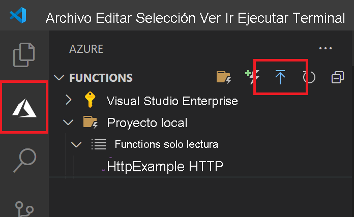

# <a name="quickstart-create-a-go-or-rust-function-in-azure-using-visual-studio-code"></a>Inicio rápido: Creación de una función de Go o Rust en Azure con Visual Studio Code

[!INCLUDE [functions-language-selector-quickstart-vs-code](../../includes/functions-language-selector-quickstart-vs-code.md)]

En este artículo se usa Visual Studio Code para crear una función de [controlador personalizado](functions-custom-handlers.md) que responda a solicitudes HTTP. Después de probar el código localmente, se implementa en el entorno sin servidor de Azure Functions.

Los controladores personalizados se pueden usar para crear funciones en cualquier lenguaje o entorno de ejecución mediante la ejecución de un proceso del servidor HTTP. En este artículo se admiten [Go](create-first-function-vs-code-other.md?tabs=go) y [Rust](create-first-function-vs-code-other.md?tabs=rust).

Este inicio rápido supone un pequeño costo en su cuenta de Azure.

## <a name="configure-your-environment"></a>Configurar su entorno

Antes de empezar, asegúrese de que cumple los siguientes requisitos:

# <a name="go"></a>[Go](#tab/go)

+ Una cuenta de Azure con una suscripción activa. [Cree una cuenta gratuita](https://azure.microsoft.com/free/?ref=microsoft.com&utm_source=microsoft.com&utm_medium=docs&utm_campaign=visualstudio).

+ [Visual Studio Code](https://code.visualstudio.com/) en una de las [plataformas admitidas](https://code.visualstudio.com/docs/supporting/requirements#_platforms).

+ La [extensión de Azure Functions](https://marketplace.visualstudio.com/items?itemName=ms-azuretools.vscode-azurefunctions) para Visual Studio Code.

+ [Azure Functions Core Tools](./functions-run-local.md#v2), versión 3.x. Use el comando `func --version` para comprobar que está correctamente instalado.

+ [Go](https://golang.org/doc/install), se recomienda la última versión. Use el comando `go version` para comprobar la versión.

# <a name="rust"></a>[Rust](#tab/rust)

+ Una cuenta de Azure con una suscripción activa. [Cree una cuenta gratuita](https://azure.microsoft.com/free/?ref=microsoft.com&utm_source=microsoft.com&utm_medium=docs&utm_campaign=visualstudio).

+ [Visual Studio Code](https://code.visualstudio.com/) en una de las [plataformas admitidas](https://code.visualstudio.com/docs/supporting/requirements#_platforms).

+ La [extensión de Azure Functions](https://marketplace.visualstudio.com/items?itemName=ms-azuretools.vscode-azurefunctions) para Visual Studio Code.

+ [Azure Functions Core Tools](./functions-run-local.md#v2), versión 3.x. Use el comando `func --version` para comprobar que está correctamente instalado.

+ Cadena de herramientas de Rust mediante [rustup](https://www.rust-lang.org/tools/install). Use el comando `rustc --version` para comprobar la versión.

---

## <a name="create-your-local-project"></a><a name="create-an-azure-functions-project"></a>Creación del proyecto local

En esta sección se usa Visual Studio Code para crear un proyecto local de controladores personalizados de Azure Functions. Más adelante en este artículo, publicará el código de función en Azure.

1. Seleccione el icono de Azure en la barra de actividades y después en el área **Azure: Functions**, seleccione el icono **Crear un proyecto**.

    

1. Elija una ubicación de directorio para el área de trabajo del proyecto y elija **Seleccionar**.

    > [!NOTE]
    > Estos pasos se han diseñado para completarse fuera de un área de trabajo. Por tanto, no seleccione una carpeta de proyecto que forme parte de un área de trabajo.

1. Escriba la siguiente información cuando se le indique:

    + **Seleccione un lenguaje para el proyecto de funciones**: Elija `Custom`.

    + **Seleccione una plantilla para la primera función del proyecto**: Elija `HTTP trigger`.

    + **Especifique un nombre de función**: Escriba `HttpExample`.

    + **Nivel de autorización**: Elija `Anonymous`, que permite que cualquier llame al punto de conexión de la función. Para obtener información sobre el nivel de autorización, consulte [Claves de autorización](functions-bindings-http-webhook-trigger.md#authorization-keys).

    + **Seleccione cómo desea que se abra el proyecto**: Elija `Add to workspace`.

1. Con esta información, Visual Studio Code genera un proyecto de Azure Functions con una función de desencadenador HTTP. Los archivos del proyecto locales se pueden ver en Explorer. Para obtener más información sobre los archivos que se crean, consulte [Archivos del proyecto generados](functions-develop-vs-code.md#generated-project-files). 

## <a name="create-and-build-your-function"></a>Creación y compilación de la función

El archivo *function.json* de la carpeta *HttpExample* declara una función de desencadenador HTTP. Para completar la función, agregue un controlador y compílela en un archivo ejecutable.

# <a name="go"></a>[Go](#tab/go)

1. Pulse <kbd>Ctrl + N</kbd> (<kbd>Cmd + N</kbd> en macOS) para crear un archivo nuevo. Guárdelo como *handler.go* en la carpeta raíz de la aplicación de funciones (en la misma carpeta que *host.json*).

1. En el archivo *handler.go*, agregue el código siguiente y guárdelo. Este es el controlador personalizado de Go.

    ```go
    package main

    import (
        "fmt"
        "log"
        "net/http"
        "os"
    )

    func helloHandler(w http.ResponseWriter, r *http.Request) {
        message := "This HTTP triggered function executed successfully. Pass a name in the query string for a personalized response.\n"
        name := r.URL.Query().Get("name")
        if name != "" {
            message = fmt.Sprintf("Hello, %s. This HTTP triggered function executed successfully.\n", name)
        }
        fmt.Fprint(w, message)
    }

    func main() {
        listenAddr := ":8080"
        if val, ok := os.LookupEnv("FUNCTIONS_CUSTOMHANDLER_PORT"); ok {
            listenAddr = ":" + val
        }
        http.HandleFunc("/api/HttpExample", helloHandler)
        log.Printf("About to listen on %s. Go to https://127.0.0.1%s/", listenAddr, listenAddr)
        log.Fatal(http.ListenAndServe(listenAddr, nil))
    }
    ```

1. Pulse <kbd>Ctrl + Mayús + `</kbd> o seleccione *Nuevo terminal* en el menú *Terminal* para abrir un nuevo terminal integrado en VS Code.

1. Compile el controlador personalizado con el siguiente comando. Se genera un archivo ejecutable llamado `handler` (`handler.exe` en Windows) en la carpeta raíz de la aplicación de funciones.

    ```bash
    go build handler.go
    ```

    

# <a name="rust"></a>[Rust](#tab/rust)

1. Pulse <kbd>Ctrl + Mayús + `</kbd> o seleccione *Nuevo terminal* en el menú *Terminal* para abrir un nuevo terminal integrado en VS Code.

1. En la carpeta raíz de la aplicación de funciones (en la misma carpeta que *host.json*), inicialice un proyecto de Rust llamado `handler`.

    ```bash
    cargo init --name handler
    ```

1. En el archivo *Cargo.toml*, agregue las siguientes dependencias necesarias para completar esta guía de inicio rápido. En el ejemplo se usa el marco de servidor web [warp](https://docs.rs/warp/).

    ```toml
    [dependencies]
    warp = "0.2"
    tokio = { version = "0.2", features = ["full"] }
    ```

1. En el archivo *src/main.rs*, agregue el código siguiente y guárdelo. Este es el controlador personalizado de Rust.

    ```rust
    use std::collections::HashMap;
    use std::env;
    use std::net::Ipv4Addr;
    use warp::{http::Response, Filter};

    #[tokio::main]
    async fn main() {
        let example1 = warp::get()
            .and(warp::path("api"))
            .and(warp::path("HttpExample"))
            .and(warp::query::<HashMap<String, String>>())
            .map(|p: HashMap<String, String>| match p.get("name") {
                Some(name) => Response::builder().body(format!("Hello, {}. This HTTP triggered function executed successfully.", name)),
                None => Response::builder().body(String::from("This HTTP triggered function executed successfully. Pass a name in the query string for a personalized response.")),
            });

        let port_key = "FUNCTIONS_CUSTOMHANDLER_PORT";
        let port: u16 = match env::var(port_key) {
            Ok(val) => val.parse().expect("Custom Handler port is not a number!"),
            Err(_) => 3000,
        };

        warp::serve(example1).run((Ipv4Addr::UNSPECIFIED, port)).await
    }
    ```

1. Compile un archivo binario para el controlador personalizado. Se genera un archivo ejecutable llamado `handler` (`handler.exe` en Windows) en la carpeta raíz de la aplicación de funciones.

    ```bash
    cargo build --release
    cp target/release/handler .
    ```

    

---

## <a name="configure-your-function-app"></a>Configuración de la aplicación de funciones

El host de la función se debe configurar para ejecutar el archivo binario del controlador personalizado al iniciarse.

1. Abra el archivo *host.json*.

1. En la sección `customHandler.description`, establezca el valor de `defaultExecutablePath` en `handler` (en Windows, establézcalo en `handler.exe`).

1. En la sección `customHandler`, agregue una propiedad llamada `enableForwardingHttpRequest` y establezca su valor en `true`. En el caso de las funciones que solo se componen de un desencadenador HTTP, esta configuración simplifica la programación, ya que permite trabajar con una solicitud HTTP típica en lugar de la [carga de la solicitud](functions-custom-handlers.md#request-payload) del controlador personalizado.

1. Confirme que la sección `customHandler` es similar a la de este ejemplo. Guarde el archivo.

    ```
    "customHandler": {
      "description": {
        "defaultExecutablePath": "handler",
        "workingDirectory": "",
        "arguments": []
      },
      "enableForwardingHttpRequest": true
    }
    ```

La aplicación de funciones está configurada para iniciar el archivo ejecutable del controlador personalizado.

## <a name="run-the-function-locally"></a>Ejecución local de la función

Puede ejecutar este proyecto en el equipo de desarrollo local antes de publicar en Azure.

1. En el terminal integrado, inicie la aplicación de funciones mediante Azure Functions Core Tools.

    ```bash
    func start
    ```

1. Con Core Tools en ejecución, vaya a la siguiente dirección URL para ejecutar una solicitud GET, que incluye la cadena de consulta `?name=Functions`.

    `http://localhost:7071/api/HttpExample?name=Functions`

1. Se devuelve una respuesta, que tiene un aspecto similar al siguiente en un explorador:

    

1. La información sobre la solicitud se muestra en el panel **Terminal**.

    

1. Pulse <kbd>Ctrl + C</kbd> para detener Core Tools.

Después de comprobar que la función se ejecuta correctamente en el equipo local, es el momento de usar Visual Studio Code para publicar el proyecto directamente en Azure.

[!INCLUDE [functions-sign-in-vs-code](../../includes/functions-sign-in-vs-code.md)]

## <a name="compile-the-custom-handler-for-azure"></a>Compilación del controlador personalizado para Azure

En esta sección, publicará el proyecto en Azure en una aplicación de funciones que ejecuta Linux. En la mayoría de los casos, debe volver a compilar el archivo binario y ajustar la configuración para que coincida con la plataforma de destino antes de publicarla en Azure.

# <a name="go"></a>[Go](#tab/go)

1. En el terminal integrado, compile el controlador en Linux/x64. Se crea un archivo binario llamado `handler` en la carpeta raíz de la aplicación de funciones.

    # <a name="macos"></a>[macOS](#tab/macos)

    ```bash
    GOOS=linux GOARCH=amd64 go build handler.go
    ```

    # <a name="linux"></a>[Linux](#tab/linux)

    ```bash
    GOOS=linux GOARCH=amd64 go build handler.go
    ```

    # <a name="windows"></a>[Windows](#tab/windows)
    ```cmd
    set GOOS=linux
    set GOARCH=amd64
    go build hello.go
    ```

    Cambie el valor de `defaultExecutablePath` en *host.json* de `handler.exe` a `handler`. Esto indica a la aplicación de funciones que ejecute el archivo binario de Linux.
    
    ---

# <a name="rust"></a>[Rust](#tab/rust)

1. Cree un archivo en *.cargo/config*. Agregue el contenido siguiente y guarde el archivo.

    ```
    [target.x86_64-unknown-linux-musl]
    linker = "rust-lld"
    ```

1. En el terminal integrado, compile el controlador en Linux/x64. Se crea un archivo binario llamado `handler`. Cópielo en la carpeta raíz de la aplicación de funciones.

    ```bash
    rustup target add x86_64-unknown-linux-musl
    cargo build --release --target=x86_64-unknown-linux-musl
    cp target/x86_64-unknown-linux-musl/release/handler .
    ```

1. Si usa Windows, cambie el valor de `defaultExecutablePath` en *host.json* de `handler.exe` a `handler`. Esto indica a la aplicación de funciones que ejecute el archivo binario de Linux.

1. Agregue la línea siguiente al archivo *.funcignore*:

    ```
    target
    ```

    Esto evita que se publique el contenido de la carpeta *target*.

---

## <a name="publish-the-project-to-azure"></a>Publicar el proyecto en Azure

En esta sección, va a crear una aplicación de funciones y los recursos relacionados en su suscripción de Azure y, después, va a implementar el código. 

> [!IMPORTANT]
> La publicación en una aplicación de función existente sobrescribe el contenido de esa aplicación en Azure. 


1. Seleccione el icono de Azure en la barra de actividades y después en el área **Azure: Functions**, seleccione el botón de **implementación en la aplicación de funciones**.

    

1. Escriba la siguiente información cuando se le indique:

    + **Seleccione la carpeta**: elija una carpeta en el área de trabajo o busque una que contenga la aplicación de funciones. No verá esta opción si ya tiene una aplicación de funciones válida abierta.

    + **Seleccione la suscripción**: elija la suscripción que desee usar. No se mostrará esta opción si solo tiene una suscripción.

    + **Seleccione la aplicación de funciones en Azure**: Elija `+ Create new Function App (advanced)`. 
    
        > [!IMPORTANT]
        > La opción `advanced` permite elegir el sistema operativo específico en el que se ejecuta la aplicación de funciones en Azure, que en este caso es Linux.

        

    + **Escriba un nombre único global para la aplicación de funciones**: Escriba un nombre que sea válido en una ruta de acceso de la dirección URL. El nombre que escriba se valida para asegurarse de que es único en Azure Functions.

    + **Seleccione una pila del entorno en tiempo de ejecución**: Elija `Custom Handler`.

    + **Seleccione un sistema operativo**: Elija `Linux`.

    + **Seleccione un plan de hospedaje**: Elija `Consumption`.

    + **Seleccione un grupo de recursos**: Elija `+ Create new resource group`. Escriba un nombre para el grupo de recursos. El nombre debe ser único en la suscripción de Azure. Puede usar el nombre sugerido en la solicitud.

    + **Seleccione una cuenta de almacenamiento**: Elija `+ Create new storage account`. Este nombre debe ser único globalmente en Azure. Puede usar el nombre sugerido en la solicitud.

    + **Seleccione un recurso de Application Insights**: Elija `+ Create Application Insights resource`. Este nombre debe ser único globalmente en Azure. Puede usar el nombre sugerido en la solicitud.

    + **Seleccione una ubicación para los nuevos recursos**:  Para mejorar el rendimiento, elija una [región](https://azure.microsoft.com/regions/) cerca de usted. La extensión muestra el estado de los recursos individuales a medida que se crean en Azure en el área de notificación.

    :::image type="content" source="../../includes/media/functions-publish-project-vscode/resource-notification.png" alt-text="Notificación de creación de recursos de Azure":::

1. Cuando se complete, se crearán los siguientes recursos de Azure en la suscripción:

    [!INCLUDE [functions-vs-code-created-resources](../../includes/functions-vs-code-created-resources.md)]

    Una vez que se haya creado la aplicación de función se mostrará una notificación y se aplicará el paquete de implementación. 

4. Seleccione **View Output** (Ver salida) en esta notificación para ver la creación y los resultados de la implementación, incluidos los recursos de Azure que ha creado. Si se pierde la notificación, seleccione el icono de campana en la esquina inferior derecha para verlo de nuevo.

    

[!INCLUDE [functions-vs-code-run-remote](../../includes/functions-vs-code-run-remote.md)]

[!INCLUDE [functions-cleanup-resources-vs-code.md](../../includes/functions-cleanup-resources-vs-code.md)]

## <a name="next-steps"></a>Pasos siguientes

> [!div class="nextstepaction"]
> [Controladores personalizados de Azure Functions](functions-custom-handlers.md)
