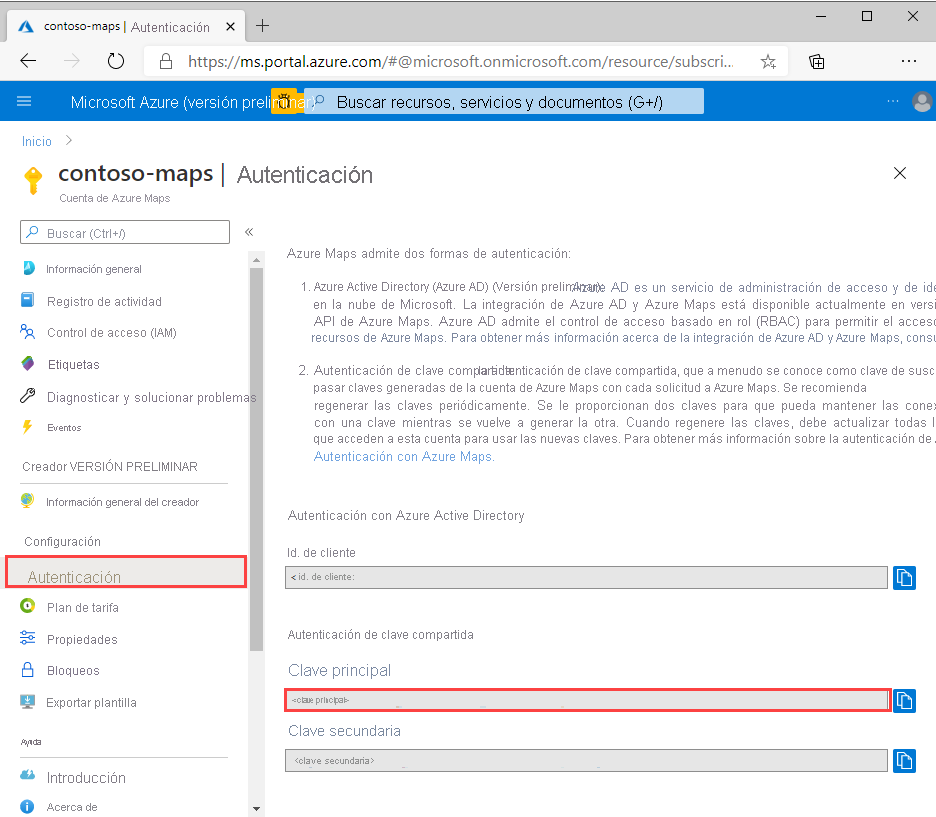
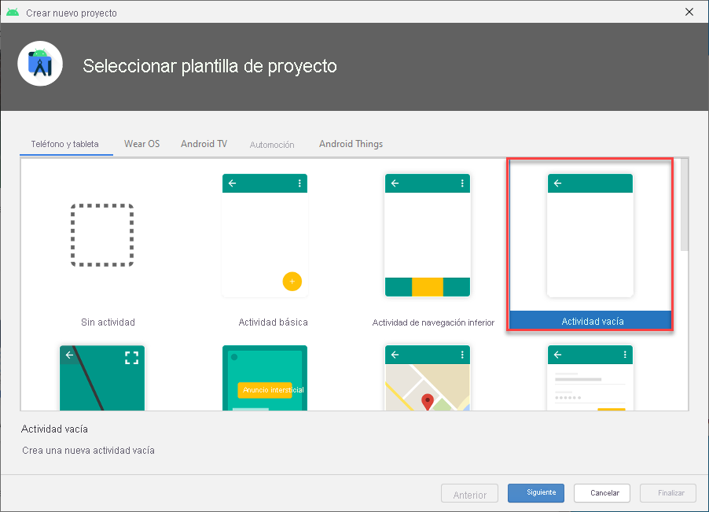
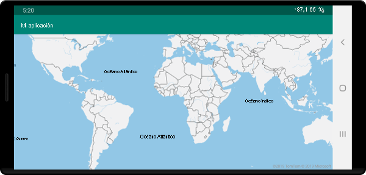

# <a name="quickstart-create-an-android-app-with-azure-maps"></a>Inicio rápido: Creación de una aplicación de Android con Azure Maps

En este artículo se muestra cómo agregar Azure Maps a una aplicación de Android. Le guía por estos pasos básicos:

* Configure un entorno de desarrollo.
* Cree su propia cuenta de Azure Maps.
* Obtenga la clave principal de Azure Maps que se usará en la aplicación.
* Haga referencia a las bibliotecas de Azure Maps desde el proyecto.
* Agregue un control de Azure Maps a la aplicación.

## <a name="prerequisites"></a>Requisitos previos

1. Cree una cuenta de Azure Maps, para lo que debe iniciar sesión en [Azure Portal](https://portal.azure.com). Si no tiene una suscripción a Azure, cree una [cuenta gratuita](https://azure.microsoft.com/free/) antes de empezar.
2. [Cree una cuenta de Azure Maps](quick-demo-map-app.md#create-an-azure-maps-account).
3. [Obtenga una clave de suscripción principal](quick-demo-map-app.md#get-the-primary-key-for-your-account), también conocida como clave principal o clave de suscripción. Para más información sobre la autenticación en Azure Maps, consulte [Administración de la autenticación en Azure Maps](how-to-manage-authentication.md).
4. [Descargue Android Studio](https://developer.android.com/studio/) gratis desde Google.

## <a name="create-an-azure-maps-account"></a>Crear una cuenta de Azure Maps

Cree una nueva cuenta de Azure Maps con los pasos siguientes:

1. En la esquina superior izquierda de [Azure Portal](https://portal.azure.com), haga clic en **Crear un recurso**.
2. En el cuadro *Buscar en el Marketplace*, escriba **Azure Maps**.
3. En los *Resultados*, seleccione **Azure Maps**. Haga clic en el botón **Crear** que aparece debajo del mapa.
4. En la página **Create Maps Account** (Crear una cuenta de Azure Maps), escriba los siguientes valores:
    * La *suscripción* que quiere usar para esta cuenta.
    * El nombre del *grupo de recursos* para esta cuenta. Puede elegir *Crear nuevo* o *Usar existente* para el grupo de recursos.
    * El *nombre* de la nueva cuenta.
    * El *Plan de tarifa* de la cuenta.
    * Lea la *licencia* y la *declaración de privacidad* y active la casilla para aceptar los términos.
    * Haga clic en el botón **Crear**.

    

## <a name="get-the-primary-key-for-your-account"></a>Obtención de la clave principal de una cuenta

Una vez que se haya creado correctamente la cuenta de Maps, recupere la clave principal que le permite consultar las API de Maps.

1. Abra su cuenta de Maps en el portal.
2. En la sección de configuración, seleccione **Autenticación**.
3. Copie la **clave principal** al Portapapeles. Guárdela localmente para usarla más adelante en este tutorial.

>[!NOTE]
> Si usa la clave de suscripción de Azure en lugar de la clave principal de Azure Maps, la asignación no se representará correctamente. Además, por motivos de seguridad, se recomienda que rote entre las claves principal y secundaria. Para rotar las claves, actualice la aplicación para que use la clave secundaria, impleméntela y, luego, presione el botón de ciclo/actualización situado junto a la clave principal para generar una nueva clave principal. La clave principal anterior se deshabilitará. Para más información sobre la rotación de claves, consulte [Configuración de Azure Key Vault con la auditoría y la rotación de claves](../key-vault/secrets/tutorial-rotation-dual.md).



## <a name="create-a-project-in-android-studio"></a>Creación de un proyecto en Android Studio

En primero lugar, cree un proyecto con una actividad vacía. Siga estos pasos para crear un proyecto de Android Studio:

1. Under **Choose your project** (Elija el proyecto), seleccione **Phone and Tablet** (Teléfono y tableta). La aplicación se ejecutará en este factor de forma.
2. En la pestaña **Phone and Tablet** (Teléfono y tableta), seleccione **Empty Activity** (Actividad vacía) y luego **Next** (Siguiente).
3. En **Configure your project** (Configurar proyecto), seleccione `API 21: Android 5.0.0 (Lollipop)` como el SDK mínimo. Se trata de la versión más antigua compatible con Android SDK para Azure Maps.
4. Acepte los valores predeterminados `Activity Name` y `Layout Name` y haga clic en **Finish** (Finalizar).

Consulte la [documentación de Android Studio](https://developer.android.com/studio/intro/) a fin de obtener más ayuda para la instalación de Android Studio y la creación de un proyecto.



## <a name="set-up-a-virtual-device"></a>Configuración de un dispositivo virtual

Android Studio permite configurar un dispositivo virtual Android en el equipo. Esto puede ayudarle a probar la aplicación durante el desarrollo. Para configurar un dispositivo virtual, seleccione el icono del dispositivo Android Virtual Device (AVD) Manager en la esquina superior derecha de la pantalla de proyecto y, a continuación, seleccione **Create Virtual Device** (Crear dispositivo virtual). También puede obtener AVD Manager seleccionando **Tools** (Herramientas) > **Android** > **AVD Manager** en la barra de herramientas. En la categoría **Phones** (Teléfonos), seleccione **Nexus 5X** y haga clic en **Next** (Siguiente).

Puede obtener más información sobre cómo configurar un AVD en la [documentación de Android Studio](https://developer.android.com/studio/run/managing-avds).


## <a name="install-the-azure-maps-android-sdk"></a>Instalación de Android SDK para Azure Maps

El siguiente paso en la creación de la aplicación es instalar el Android SDK para Azure Maps. Para instalar el SDK, siga estos pasos:

1. Abra el archivo **build.gradle** de nivel superior y agregue el siguiente código a la sección de bloques **all projects**, **repositories** (todos los proyectos, repositorios):

    ```gradle
    maven {
        url "https://atlas.microsoft.com/sdk/android"
    }
    ```

2. Actualice **app/build.gradle** y agréguele el siguiente código:

    1. Asegúrese de que el valor de **minSdkVersion** del proyecto es API 21 o superior.

    2. Agregue el siguiente código a la sección Android:

        ```gradle
        compileOptions {
            sourceCompatibility JavaVersion.VERSION_1_8
            targetCompatibility JavaVersion.VERSION_1_8
        }
        ```

    3. Actualice el bloque de dependencias y agregue una nueva línea de dependencia de implementación para el Android SDK de Azure Maps más reciente:

        ```gradle
        implementation "com.microsoft.azure.maps:mapcontrol:0.7"
        ```

        > [!Note]
        > Puede establecer el número de versión en "0+" para que el código apunte siempre a la versión más reciente.

    4. Vaya a **Archivo** en la barra de herramientas y haga clic en **Sincronizar proyecto con archivos de Gradle**.
3. Agregue un fragmento de mapa a la actividad principal (recurso \> diseño \> activity\_main.xml):

    ```xml
    <com.microsoft.azure.maps.mapcontrol.MapControl
        android:id="@+id/mapcontrol"
        android:layout_width="match_parent"
        android:layout_height="match_parent"
        />
    ```

::: zone pivot="programming-language-java-android"

4. En el archivo **MainActivity.java**, tendrá que hacer lo siguiente:

    * agregar las importaciones del SDK de Azure Maps
    * establecer la información de autenticación de Azure Maps
    * obtener la instancia del control de mapa en el método **onCreate**

    La configuración de la información de autenticación en la clase `AzureMaps` de forma global mediante los métodos `setSubscriptionKey` o `setAadProperties` hace que no tenga que agregar la información de autenticación en cada vista.

    El control de mapa contiene sus propios métodos de ciclo de vida para administrar el ciclo de vida de OpenGL de Android. Estos métodos de ciclo de vida deben llamarse directamente desde la actividad contenedora. Para que la aplicación llame correctamente a los métodos de ciclo de vida del control de mapa, debe invalidar los siguientes métodos de ciclo de vida en la actividad que contiene el control de mapa. Además, debe llamar al método de control de mapa correspondiente.

    * `onCreate(Bundle)`
    * `onDestroy()`
    * `onLowMemory()`
    * `onPause()`
    * `onResume()`
    * `onSaveInstanceState(Bundle)`
    * `onStart()`
    * `onStop()`

    Edite el **MainActivity.java** como sigue:

    ```java
    package com.example.myapplication;
    
    import androidx.appcompat.app.AppCompatActivity;
    import com.microsoft.azure.maps.mapcontrol.AzureMaps;
    import com.microsoft.azure.maps.mapcontrol.MapControl;
    import com.microsoft.azure.maps.mapcontrol.layer.SymbolLayer;
    import com.microsoft.azure.maps.mapcontrol.options.MapStyle;
    import com.microsoft.azure.maps.mapcontrol.source.DataSource;
    
    public class MainActivity extends AppCompatActivity {
        
    static {
        AzureMaps.setSubscriptionKey("<Your Azure Maps subscription key>");

        //Alternatively use Azure Active Directory authenticate.
        //AzureMaps.setAadProperties("<Your aad clientId>", "<Your aad AppId>", "<Your aad Tenant>");
    }

    MapControl mapControl;

    @Override
    protected void onCreate(Bundle savedInstanceState) {
        super.onCreate(savedInstanceState);
        setContentView(R.layout.activity_main);

        mapControl = findViewById(R.id.mapcontrol);

        mapControl.onCreate(savedInstanceState);

        //Wait until the map resources are ready.
        mapControl.onReady(map -> {
            //Add your post map load code here.

        });
    }

    @Override
    public void onResume() {
        super.onResume();
        mapControl.onResume();
    }

    @Override
    protected void onStart(){
        super.onStart();
        mapControl.onStart();
    }

    @Override
    public void onPause() {
        super.onPause();
        mapControl.onPause();
    }

    @Override
    public void onStop() {
        super.onStop();
        mapControl.onStop();
    }

    @Override
    public void onLowMemory() {
        super.onLowMemory();
        mapControl.onLowMemory();
    }

    @Override
    protected void onDestroy() {
        super.onDestroy();
        mapControl.onDestroy();
    }

    @Override
    protected void onSaveInstanceState(Bundle outState) {
        super.onSaveInstanceState(outState);
        mapControl.onSaveInstanceState(outState);
    }}
    ```

    > [!NOTE]
    > Después de completar los pasos anteriores, podrían aparecer algunas advertencias de Android Studio sobre el código. Para solucionar estas advertencias, importe las clases a las que se hace referencia en `MainActivity.java`.
    > Para importar automáticamente estas clases, seleccione `Alt` + `Enter` (`Option` + `Return` en un equipo Mac).

::: zone-end

::: zone pivot="programming-language-kotlin"

4. En el archivo **MainActivity.kt**, tendrá que hacer lo siguiente:

    * agregar las importaciones del SDK de Azure Maps
    * establecer la información de autenticación de Azure Maps
    * obtener la instancia del control de mapa en el método **onCreate**

    La configuración de la información de autenticación en la clase `AzureMaps` de forma global mediante los métodos `setSubscriptionKey` o `setAadProperties` hace que no tenga que agregar la información de autenticación en cada vista.

    El control de mapa contiene sus propios métodos de ciclo de vida para administrar el ciclo de vida de OpenGL de Android. Estos métodos de ciclo de vida deben llamarse directamente desde la actividad contenedora. Para que la aplicación llame correctamente a los métodos de ciclo de vida del control de mapa, debe invalidar los siguientes métodos de ciclo de vida en la actividad que contiene el control de mapa. Además, debe llamar al método de control de mapa correspondiente.

    * `onCreate(Bundle)`
    * `onDestroy()`
    * `onLowMemory()`
    * `onPause()`
    * `onResume()`
    * `onSaveInstanceState(Bundle)`
    * `onStart()`
    * `onStop()`

    Edite el archivo **MainActivity.kt** de este modo:

    ```kotlin
    package com.example.myapplication;

    import androidx.appcompat.app.AppCompatActivity
    import android.os.Bundle
    import com.microsoft.azure.maps.mapcontrol.AzureMap
    import com.microsoft.azure.maps.mapcontrol.AzureMaps
    import com.microsoft.azure.maps.mapcontrol.MapControl
    import com.microsoft.azure.maps.mapcontrol.events.OnReady
    
    class MainActivity : AppCompatActivity() {
    
        companion object {
            init {
                AzureMaps.setSubscriptionKey("<Your Azure Maps subscription key>");
    
                //Alternatively use Azure Active Directory authenticate.
                //AzureMaps.setAadProperties("<Your aad clientId>", "<Your aad AppId>", "<Your aad Tenant>");
            }
        }
    
        var mapControl: MapControl? = null
    
        override fun onCreate(savedInstanceState: Bundle?) {
            super.onCreate(savedInstanceState)
            setContentView(R.layout.activity_main)
    
            mapControl = findViewById(R.id.mapcontrol)
    
            mapControl?.onCreate(savedInstanceState)
    
            //Wait until the map resources are ready.
            mapControl?.onReady(OnReady { map: AzureMap -> })
        }
    
        public override fun onStart() {
            super.onStart()
            mapControl?.onStart()
        }
    
        public override fun onResume() {
            super.onResume()
            mapControl?.onResume()
        }
    
        public override fun onPause() {
            mapControl?.onPause()
            super.onPause()
        }
    
        public override fun onStop() {
            mapControl?.onStop()
            super.onStop()
        }
    
        override fun onLowMemory() {
            mapControl?.onLowMemory()
            super.onLowMemory()
        }
    
        override fun onDestroy() {
            mapControl?.onDestroy()
            super.onDestroy()
        }
    
        override fun onSaveInstanceState(outState: Bundle) {
            super.onSaveInstanceState(outState)
            mapControl?.onSaveInstanceState(outState)
        }
    }
    ```

    > [!NOTE]
    > Después de completar los pasos anteriores, podrían aparecer algunas advertencias de Android Studio sobre el código. Para solucionar estas advertencias, importe las clases a las que se hace referencia en `MainActivity.kt`.
    > Para importar automáticamente estas clases, seleccione `Alt` + `Enter` (`Option` + `Return` en un equipo Mac).

::: zone-end

5. Seleccione el botón de ejecución, como se muestra en el siguiente gráfico (o presione `Control` + `R` en un equipo Mac), para compilar la aplicación.

    

Android Studio tardará unos segundos en crear la aplicación. Una vez finalizada la compilación, puede probar la aplicación en el dispositivo Android emulado. Debería ver un mapa como el siguiente:



## <a name="clean-up-resources"></a>Limpieza de recursos

>[!WARNING]
> Los tutoriales que se enumeran en la sección [Pasos siguientes](#next-steps) describen cómo usar y configurar Azure Maps con su cuenta. Si tiene pensado seguir con los tutoriales, no elimine los recursos que se crearon con este inicio rápido.

Si no tiene previsto continuar con los tutoriales, siga estos pasos para realizar la limpieza de recursos:

1. Cierre Android Studio y elimine la aplicación que ha creado.
2. Si ha probado la aplicación en un dispositivo externo, desinstálela del mismo.

Si no planea continuar desarrollando con el Android SDK de Azure Maps:

1. Vaya a la página de Azure Portal. En la página principal del portal, seleccione **Todos los recursos**. O bien, haga clic en el icono de menú en la esquina superior izquierda. Seleccione **Todos los recursos**.
2. Haga clic en la cuenta de Azure Maps. Haga clic en **Eliminar** en la parte superior de la página.
3. Si no planea seguir desarrollando aplicaciones de Android, puede desinstalar Android Studio.

Para ver más ejemplos de código, consulte estas guías:

* [Administración de la autenticación en Azure Maps](how-to-manage-authentication.md)
* [Cambio de estilos de mapa en mapas de Android](set-android-map-styles.md)
* [Adición de una capa de símbolo](how-to-add-symbol-to-android-map.md)
* [Adición de una capa de línea](android-map-add-line-layer.md)
* [Adición de una capa de polígono](how-to-add-shapes-to-android-map.md)

## <a name="next-steps"></a>Pasos siguientes

En esta guía de inicio rápido, ha creado la cuenta de Azure Maps y ha creado una aplicación de demostración. Consulte los siguientes tutoriales para más información sobre Azure Maps:

> [!div class="nextstepaction"]
> [Carga de datos GeoJSON en Azure Maps](tutorial-load-geojson-file-android.md)