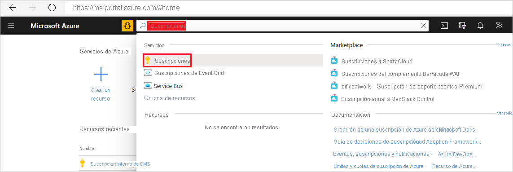
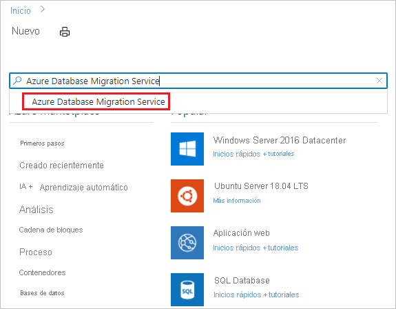
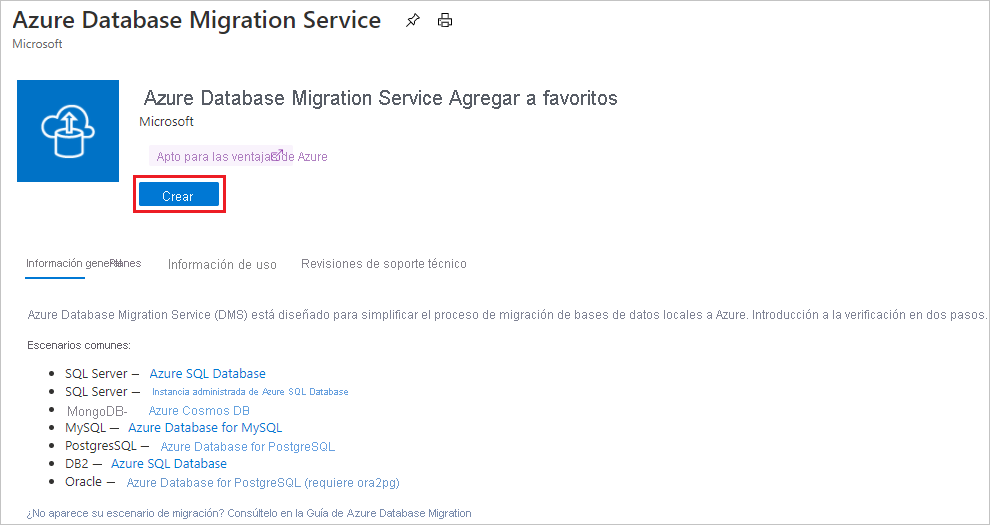
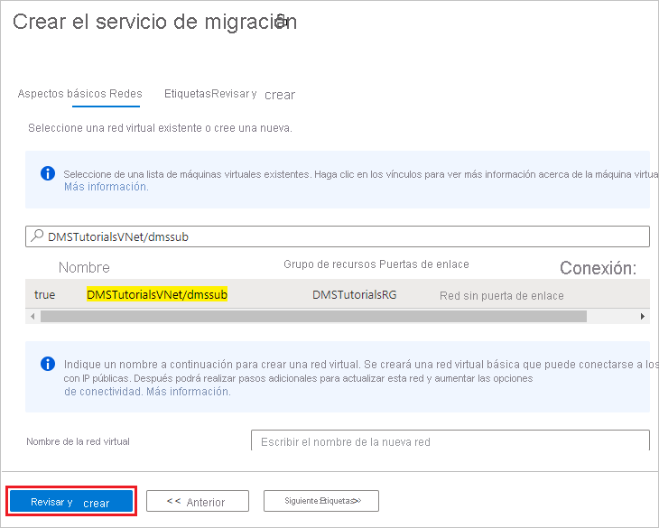

# Inicio rápido: Creación de una instancia de Azure Database Migration Service mediante Azure Portal

En este inicio rápido, puede usar Azure Portal para crear una instancia de Azure Database Migration Service. Después de crear la instancia, puede usarla para migrar datos desde varios orígenes de base de datos a plataformas de datos de Azure, como desde SQL Server a Azure SQL Database o desde SQL Server a Azure SQL Managed Instance.

Si no tiene una suscripción a Azure, cree una cuenta [gratuita](https://azure.microsoft.com/free/) antes de empezar.

## Inicio de sesión en Azure Portal

Abra el explorador web, vaya a [Microsoft Azure Portal](https://portal.azure.com/) y, a continuación, escriba sus credenciales para iniciar sesión en el portal. La vista predeterminada es el panel del servicio.

> [!NOTE]
> Puede crear hasta 10 instancias de DMS por suscripción y región. Si necesita un número mayor de instancias, cree una incidencia de soporte técnico.

## Registrar el proveedor de recursos

Registre el proveedor de recursos Microsoft.DataMigration antes de crear su primera instancia de Database Migration Service.

1. En Azure Portal, seleccione **Suscripciones**.

   

2. Seleccione la suscripción en la que quiere crear la instancia de Azure Database Migration Service y después seleccione **Proveedores de recursos**.

    

3. Busque la migración y, después, seleccione **Registrar** para **Microsoft.DataMigration**.

    

## Creación de una instancia del servicio

1. En el menú de Azure Portal o en la página **principal**, seleccione **Crear un recurso**. Busque y seleccione **Azure Database Migration Service**.

    

2. En la pantalla **Azure Database Migration Service**, seleccione **Crear**.

    

3. En la pantalla de aspectos básicos **Crear el servicio de migración**:

     - Seleccione la suscripción.
     - Cree un grupo de recursos o seleccione uno existente.
     - Especifique un nombre para la instancia de Azure Database Migration Service.
     - Seleccione la ubicación en la que quiere crear la instancia de Azure Database Migration Service.
     - Elija **Azure** como modo de servicio.
     - Seleccione un plan de tarifa. Para más información sobre los costos y planes de tarifa, vea la [página de precios](https://aka.ms/dms-pricing).
     
    

     - Seleccione Siguiente: Redes.

4. En la pantalla de red **Crear el servicio de migración**:

    - Seleccione una red virtual existente o cree una nueva. La red virtual proporciona a Azure Database Migration Service acceso a la base de datos de origen y al entorno de destino. Para más información sobre cómo crear una red virtual en Azure Portal, consulte el artículo [Creación de una red virtual con Azure Portal](../virtual-network/quick-create-portal.md).

    

    - Seleccione **Revisar y crear** para crear el servicio. 
    
    - Transcurridos unos instantes, se crea la instancia de Azure Database Migration Service y estará lista para usarse:

    

## Limpieza de recursos

Puede limpiar los recursos creados en este inicio rápido mediante la eliminación del [grupo de recursos de Azure](../azure-resource-manager/management/overview.md). Para eliminar el grupo de recursos, navegue a la instancia de Azure Database Migration Service que creó. Seleccione el nombre del **grupo de recursos** y, luego, seleccione **Eliminar grupo de recursos**. Esta acción elimina todos los activos del grupo de recursos, así como el mismo grupo.

## Pasos siguientes

* [Migración de SQL Server a Azure SQL Database sin conexión](tutorial-sql-server-to-azure-sql.md)
* [Migración de SQL Server a Azure SQL Database en línea](tutorial-sql-server-azure-sql-online.md)
* [Migración de SQL Server a Azure SQL Managed Instance sin conexión](tutorial-sql-server-to-managed-instance.md)
* [Migración de SQL Server a Azure SQL Managed Instance en línea](tutorial-sql-server-managed-instance-online.md)