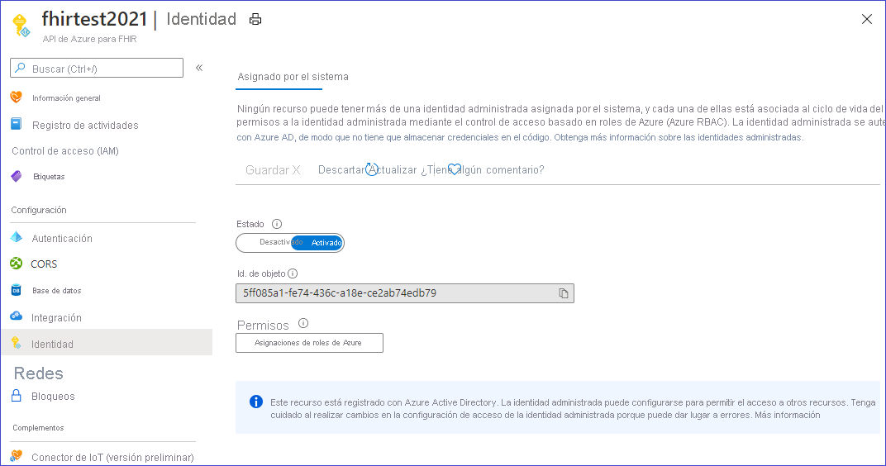
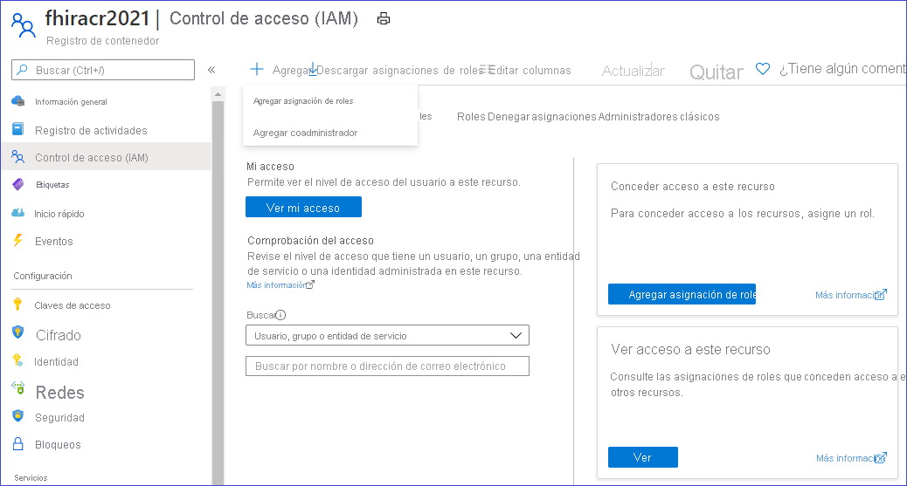
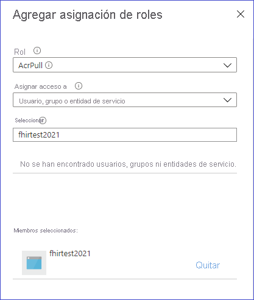

# <a name="how-to-convert-data-to-fhir-preview"></a>Procedimientos para la conversión de datos a FHIR (versión preliminar)

> [!IMPORTANT]
> Esta funcionalidad se encuentra en versión preliminar pública, se ofrece sin contrato de nivel de servicio y no se recomienda usarla para cargas de trabajo de producción. Es posible que algunas características no sean compatibles o que tengan sus funcionalidades limitadas. Para más información, consulte [Términos de uso complementarios de las Versiones Preliminares de Microsoft Azure](https://azure.microsoft.com/support/legal/preview-supplemental-terms/).

El punto de conexión personalizado $convert-data de Azure API for FHIR está destinado a la conversión de datos de diferentes formatos a FHIR. Usa el motor de la plantilla Liquid y las plantillas del proyecto [FHIR Converter](https://github.com/microsoft/FHIR-Converter) como plantillas predeterminadas. Estas plantillas de conversión se pueden personalizar según sea necesario. Actualmente admite la conversión de HL7v2 a FHIR.

## <a name="use-the-convert-data-endpoint"></a>Uso del punto de conexión $convert-data

`https://<<FHIR service base URL>>/$convert-data`

$convert-data toma un recurso de [parámetro](http://hl7.org/fhir/parameters.html) del cuerpo de la solicitud como se describe a continuación:

**Recurso de parámetro:**

| Nombre de parámetro      | Descripción | Valores aceptados |
| ----------- | ----------- | ----------- |
| inputData      | Datos que se van a convertir. | Un valor válido del tipo de datos Cadena JSON|
| inputDataType   | Tipo de datos de entrada. | ```HL7v2``` |
| templateCollectionReference | Referencia a una colección de plantillas. Puede ser una referencia a las **plantillas predeterminadas** o a una imagen de plantilla personalizada que esté registrada en Azure API for FHIR. A continuación puede aprender a personalizar las plantillas, hospedarlas en ACR y registrarse en Azure API for FHIR.  | ```microsofthealth/fhirconverter:default```, \<RegistryServer\>/\<imageName\>@\<imageDigest\> |
| rootTemplate | La plantilla raíz que se usa al transformar los datos. | ```ADT_A01```, ```OML_O21```, ```ORU_R01```, ```VXU_V04``` |  

> [!WARNING]
> Las plantillas predeterminadas le ayudan a ponerse en marcha rápidamente. Sin embargo, es posible que se actualicen al actualizar Azure API for FHIR. Para tener un comportamiento coherente en la conversión de datos en diferentes versiones de Azure API for FHIR, debe hospedar su propia copia de las plantillas en una instancia de Azure Container Registry, registrarlas en Azure API for FHIR y usarlas en las llamadas API como se describe más adelante.

**Solicitud de ejemplo:**

```json
{
    "resourceType": "Parameters",
    "parameter": [
        {
            "name": "inputData",
            "valueString": "MSH|^~\\&|SIMHOSP|SFAC|RAPP|RFAC|20200508131015||ADT^A01|517|T|2.3|||AL||44|ASCII\nEVN|A01|20200508131015|||C005^Whittingham^Sylvia^^^Dr^^^DRNBR^PRSNL^^^ORGDR|\nPID|1|3735064194^^^SIMULATOR MRN^MRN|3735064194^^^SIMULATOR MRN^MRN~2021051528^^^NHSNBR^NHSNMBR||Kinmonth^Joanna^Chelsea^^Ms^^CURRENT||19870624000000|F|||89 Transaction House^Handmaiden Street^Wembley^^FV75 4GJ^GBR^HOME||020 3614 5541^HOME|||||||||C^White - Other^^^||||||||\nPD1|||FAMILY PRACTICE^^12345|\nPV1|1|I|OtherWard^MainRoom^Bed 183^Simulated Hospital^^BED^Main Building^4|28b|||C005^Whittingham^Sylvia^^^Dr^^^DRNBR^PRSNL^^^ORGDR|||CAR|||||||||16094728916771313876^^^^visitid||||||||||||||||||||||ARRIVED|||20200508131015||"
        },
        {
            "name": "inputDataType",
            "valueString": "Hl7v2"
        },
        {
            "name": "templateCollectionReference",
            "valueString": "microsofthealth/fhirconverter:default"
        },
        {
            "name": "rootTemplate",
            "valueString": "ADT_A01"
        }
    ]
}
```

**Respuesta de ejemplo:**

```json
{
  "resourceType": "Bundle",
  "type": "transaction",
  "entry": [
    {
      "fullUrl": "urn:uuid:9d697ec3-48c3-3e17-db6a-29a1765e22c6",
      "resource": {
        "resourceType": "Patient",
        "id": "9d697ec3-48c3-3e17-db6a-29a1765e22c6",
        ...
        ...
      "request": {
        "method": "PUT",
        "url": "Location/50becdb5-ff56-56c6-40a1-6d554dca80f0"
      }
    }
  ]
}
```

## <a name="customize-templates"></a>Personalización de plantillas

Puede usar la extensión [FHIR Converter](https://marketplace.visualstudio.com/items?itemName=ms-azuretools.vscode-health-fhir-converter) para Visual Studio Code para personalizar las plantillas según sus necesidades. La extensión proporciona una experiencia de edición interactiva y facilita la descarga de plantillas publicadas por Microsoft y datos de ejemplo. Para más información, consulte la documentación de la extensión.

## <a name="host-and-use-templates"></a>Hospedaje y uso de plantillas

Se recomienda encarecidamente que hospede su propia copia de las plantillas en ACR. Para hospedar su propia copia de las plantillas y usarlas en la operación $convert-data es preciso seguir estos cuatro pasos:

1. Inserte la imagen en un una instancia de Azure Container Registry.
1. Habilite Identidad administrada en la instancia de Azure API for FHIR.
1. Proporcione acceso del ACR a Identidad administrada de Azure API for FHIR.
1. Registre los servidores de ACR en Azure API for FHIR.

### <a name="push-templates-to-azure-container-registry"></a>Inserción de plantillas en Azure Container Registry

Después de crear una instancia de Azure Container Registry, puede usar el comando _FHIR Converter: Push Templates_ en la [extensión FHIR Converter](https://marketplace.visualstudio.com/items?itemName=ms-azuretools.vscode-health-fhir-converter) para insertar las plantillas personalizadas en ACR. Como alternativa, puede usar la [herramienta CLI de administración de plantillas](https://github.com/microsoft/FHIR-Converter/blob/main/docs/TemplateManagementCLI.md) para tal fin.

### <a name="enable-managed-identity-on-azure-api-for-fhir"></a>Habilitación de Identidad administrada en Azure API for FHIR

Vaya a la instancia del servicio Azure API for FHIR en Azure Portal y seleccione la hoja **Identity** (Identidad).
Cambie el estado a **Activado** para habilitar Identidad administrada en Azure API for FHIR.



### <a name="provide-access-of-the-acr-to-azure-api-for-fhir"></a>Proporcione acceso del ACR a Azure API for FHIR

Vaya a la hoja Access Control (IAM) de su instancia de ACR y seleccione _Agregar asignación de roles_.



Conceda el rol AcrPull a su instancia del servicio Azure API for FHIR.



### <a name="register-the-acr-servers-in-azure-api-for-fhir"></a>Registro de los servidores de ACR en Azure API for FHIR

En Azure API for FHIR se pueden registrar un máximo de veinte servidores de ACR.

Instale la CLI de healthcareapis desde Azure PowerShell si fuera necesario:

```powershell
az extension add -n healthcareapis
```

Para registrar los servidores de ACR en Azure API for FHIR siga estos ejemplos:

#### <a name="register-a-single-acr-server"></a>Registro de un servidor de ACR individual

```powershell
az healthcareapis acr add --login-servers "fhiracr2021.azurecr.io" --resource-group fhir-test --resource-name fhirtest2021
```

#### <a name="register-multiple-acr-servers"></a>Registro de varios servidores de ACR

```powershell
az healthcareapis acr add --login-servers "fhiracr2021.azurecr.io fhiracr2020.azurecr.io" --resource-group fhir-test --resource-name fhirtest2021
```

### <a name="verify"></a>Comprobación

Realice una llamada a la API de $convert-data, en la que especifique la referencia de la plantilla en el parámetro templateCollectionReference.

`<RegistryServer>/<imageName>@<imageDigest>`

## <a name="known-issues-and-workarounds"></a>Problemas conocidos y soluciones alternativas

- Algunos archivos de plantilla predeterminados contienen BOM UTF-8. Como consecuencia, los valores de identificador generados contendrán un carácter de BOM, lo que puede generar un problema con el servidor de FHIR. La solución consiste en extraer las plantillas de Microsoft mediante una extensión de VS Code e insertarlas en su propio ACR después de quitar los caracteres BOM de _ID/_Procedure.liquid_, _ID/_Provenance.liquid_ e _ID/_Immunization.liquid_.

