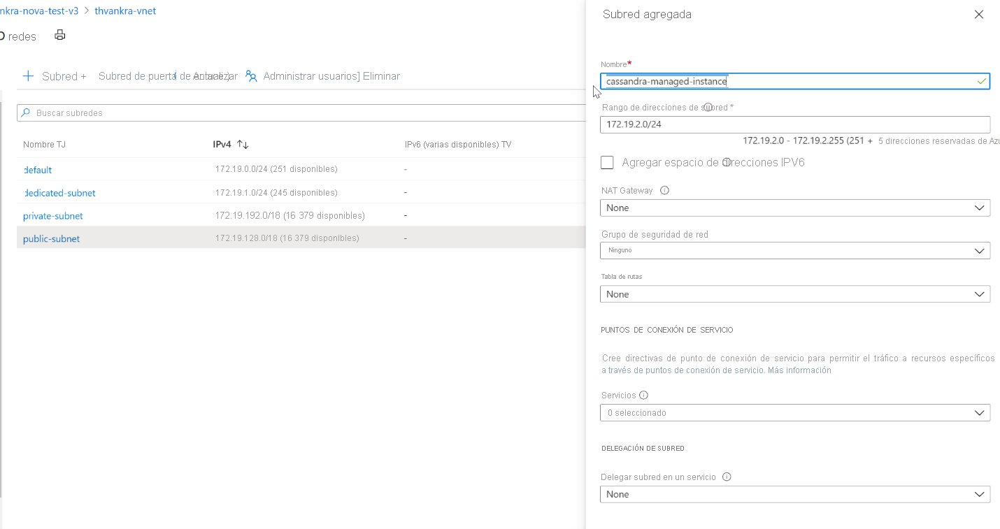

# <a name="quickstart-configure-a-hybrid-cluster-with-azure-managed-instance-for-apache-cassandra-preview"></a>Inicio rápido: Configuración de un clúster híbrido con Azure Managed Instance for Apache Cassandra (versión preliminar)

Azure Managed Instance for Apache Cassandra proporciona operaciones de implementación y escalado automatizadas para los centros de datos administrados de código abierto de Apache Cassandra. Este servicio le ayuda a acelerar los escenarios híbridos y a reducir el mantenimiento continuo.

> [!IMPORTANT]
> Azure Managed Instance for Apache Cassandra se encuentra actualmente en versión preliminar pública.
> Esta versión preliminar se ofrece sin Acuerdo de Nivel de Servicio y no se recomienda para cargas de trabajo de producción. Es posible que algunas características no sean compatibles o que tengan sus funcionalidades limitadas.
> Para más información, consulte [Términos de uso complementarios de las Versiones Preliminares de Microsoft Azure](https://azure.microsoft.com/support/legal/preview-supplemental-terms/).

En esta guía de inicio rápido se muestra cómo usar los comandos de la CLI de Azure para configurar un clúster híbrido. Si tiene centros de datos existentes en un entorno local o autohospedado, puede usar Azure Managed Instance for Apache Cassandra para agregar otros centros de datos a ese clúster y mantenerlos.

[!INCLUDE [azure-cli-prepare-your-environment.md](../../includes/azure-cli-prepare-your-environment.md)]

* Este artículo requiere la CLI de Azure 2.12.1 o una versión posterior. Si usa Azure Cloud Shell, la versión más reciente ya está instalada.

* [Azure Virtual Network](../virtual-network/virtual-networks-overview.md) con conectividad a su entorno autohospedado o local. Para más información sobre cómo conectar entornos locales a Azure, consulte el artículo [Conexión de una red local a Azure](https://docs.microsoft.com/azure/architecture/reference-architectures/hybrid-networking/).

## <a name="configure-a-hybrid-cluster"></a><a id="create-account"></a>Configuración de un clúster híbrido

1. Inicie sesión en [Azure Portal](https://portal.azure.com/) y vaya al recurso de Virtual Network.

1. Abra la pestaña **Subredes** y cree una nueva subred. Para más información sobre los campos del formulario **Agregar subred**, consulte el artículo [Incorporación, cambio o eliminación de una subred de red virtual](../virtual-network/virtual-network-manage-subnet.md#add-a-subnet):

   :::image type="content" source="./media/configure-hybrid-cluster/subnet.png" alt-text="Adición de una nueva subred a la red virtual." lightbox="./media/configure-hybrid-cluster/subnet.png" border="true":::
    <!--  -->

1. Ahora aplicaremos algunos permisos especiales a la red virtual y a la subred que requiere Managed Instance for Apache Cassandra mediante la CLI de Azure. En primer lugar, necesitamos detectar el valor de `Resource ID` de la red virtual existente. Copie la salida del valor de este comando para más adelante, este es el elemento `Resource ID`.

   ```azurecli-interactive
    # discover the vnet id
    az network vnet show -n <your VNet name> -g <Resource Group Name> --query "id" --output tsv
   ```

1. Ahora se aplican los permisos especiales, pasando la salida del comando anterior como parámetro de ámbito:

   ```azurecli-interactive
    az role assignment create --assignee e5007d2c-4b13-4a74-9b6a-605d99f03501 --role 4d97b98b-1d4f-4787-a291-c67834d212e7 --scope <Resource ID>
   ```
    > [!NOTE]
    > Los valores de `assignee` y `role` anteriores son los identificadores fijos de la entidad de servicio y el rol, respectivamente. 

1. A continuación, vamos a configurar los recursos para nuestro clúster híbrido. Puesto que ya tiene un clúster, el nombre del clúster solo será un recurso lógico para identificar el nombre del clúster existente. Asegúrese de usar el nombre del clúster existente al definir las variables `clusterName` y `clusterNameOverride` en el script siguiente.

   También necesita los nodos de inicialización, los certificados de cliente públicos (si ha configurado una clave pública y privada en el punto de conexión de Cassandra) y los certificados de intercambio del clúster existente. También necesitará usar el identificador de recurso que copió anteriormente para definir la variable `delegatedManagementSubnetId`.

   ```azurecli-interactive
   resourceGroupName='MyResourceGroup'
   clusterName='cassandra-hybrid-cluster-legal-name'
   clusterNameOverride='cassandra-hybrid-cluster-illegal-name'
   location='eastus2'
   delegatedManagementSubnetId='<Resource ID>'
    
   # You can override the cluster name if the original name is not legal for an Azure resource:
   # overrideClusterName='ClusterNameIllegalForAzureResource'
   # the default cassandra version will be v3.11
    
   az managed-cassandra cluster create \
      --cluster-name $clusterName \
      --resource-group $resourceGroupName \
      --location $location \
      --delegated-management-subnet-id $delegatedManagementSubnetId \
      --external-seed-nodes 10.52.221.2,10.52.221.3,10.52.221.4
      --client-certificates 'BEGIN CERTIFICATE-----\n...PEM format..\n-----END CERTIFICATE-----','BEGIN CERTIFICATE-----\n...PEM format...\n-----END CERTIFICATE-----' \
      --external-gossip-certificates 'BEGIN CERTIFICATE-----\n...PEM format 1...\n-----END CERTIFICATE-----','BEGIN CERTIFICATE-----\n...PEM format 2...\n-----END CERTIFICATE-----'
   ```

    > [!NOTE]
    > Debe saber dónde se conservan los certificados públicos y de intercambio existentes. Si no está seguro, debería poder ejecutar `keytool -list -keystore <keystore-path> -rfc -storepass <password>` para imprimir los certificados. 

1. Una vez creado el recurso del clúster, ejecute el siguiente comando para obtener los detalles de configuración del clúster:

   ```azurecli-interactive
   resourceGroupName='MyResourceGroup'
   clusterName='cassandra-hybrid-cluster'
    
   az managed-cassandra cluster show \
       --cluster-name $clusterName \
       --resource-group $resourceGroupName \
   ```

1. El comando anterior devuelve información sobre el entorno de la instancia administrada. Necesitará los certificados de intercambio para poder instalarlos en los nodos del centro de datos existente. En la captura de pantalla siguiente se muestra la salida del comando anterior y el formato de los certificados:

   :::image type="content" source="./media/configure-hybrid-cluster/show-cluster.png" alt-text="Obtenga los detalles del certificado del clúster." lightbox="./media/configure-hybrid-cluster/show-cluster.png" border="true":::
    <!--  -->

1. A continuación, cree un nuevo centro de datos en el clúster híbrido. Asegúrese de reemplazar los valores de las variables por los detalles del clúster:

   ```azurecli-interactive
   resourceGroupName='MyResourceGroup'
   clusterName='cassandra-hybrid-cluster'
   dataCenterName='dc1'
   dataCenterLocation='eastus2'
   delegatedSubnetId= '<Resource ID>'
    
   az managed-cassandra datacenter create \
       --resource-group $resourceGroupName \
       --cluster-name $clusterName \
       --data-center-name $dataCenterName \
       --data-center-location $dataCenterLocation \
       --delegated-subnet-id $delegatedSubnetId \
       --node-count 9 
   ```

1. Ahora que se ha creado el nuevo centro de datos, ejecute el comando datacenter show para ver sus detalles:

   ```azurecli-interactive
   resourceGroupName='MyResourceGroup'
   clusterName='cassandra-hybrid-cluster'
   dataCenterName='dc1'
    
   az managed-cassandra datacenter show \
       --resource-group $resourceGroupName \
       --cluster-name $clusterName \
       --data-center-name $dataCenterName 
   ```

1. El comando anterior incluye en la salida los nodos de inicialización del nuevo centro de recursos. Agregue los nodos de inicialización del nuevo centro de datos a la configuración del centro de datos existente en el archivo *cassandra.yaml*. Además, instale los certificados de intercambio de la instancia administrada que recopiló anteriormente:

   :::image type="content" source="./media/configure-hybrid-cluster/show-datacenter.png" alt-text="Obtención de detalles del centro de datos." lightbox="./media/configure-hybrid-cluster/show-datacenter.png" border="true":::
    <!--  -->

    > [!NOTE]
    > Si desea agregar más centros de datos, puede repetir los pasos anteriores, pero solo necesita los nodos de inicialización. 

1. Por último, use la siguiente consulta CQL para actualizar la estrategia de replicación de cada espacio de claves para incluir todos los centros de datos del clúster:

   ```bash
   ALTER KEYSPACE "ks" WITH REPLICATION = {'class': 'NetworkTopologyStrategy', ‘on-premise-dc': 3, ‘managed-instance-dc': 3};
   ```
   También debe actualizar las tablas de contraseñas:

   ```bash
    ALTER KEYSPACE "system_auth" WITH REPLICATION = {'class': 'NetworkTopologyStrategy', ‘on-premise-dc': 3, ‘managed-instance-dc': 3}
   ```

## <a name="clean-up-resources"></a>Limpieza de recursos

Si no va a seguir usando este clúster de instancia administrada, elimínelo mediante los siguientes pasos:

1. En el menú de la izquierda de Azure Portal, seleccione **Grupos de recursos**.
1. En la lista, seleccione el grupo de recursos que creó para este inicio rápido.
1. En el panel **Información general** del grupo de recursos, seleccione **Eliminar grupo de recursos**.
3. En la ventana siguiente, escriba el nombre del grupo de recursos que desea eliminar y, después, seleccione **Eliminar**.

## <a name="next-steps"></a>Pasos siguientes

En esta guía de inicio rápido, ha aprendido a crear un clúster híbrido con la CLI de Azure y Azure Managed Instance for Apache Cassandra. Ahora puede empezar a trabajar con el clúster.

> [!div class="nextstepaction"]
> [Administración de recursos de Azure Managed Instance for Apache Cassandra mediante la CLI de Azure](manage-resources-cli.md)