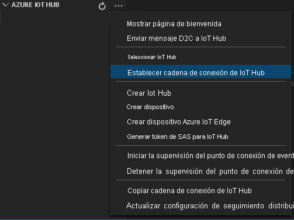
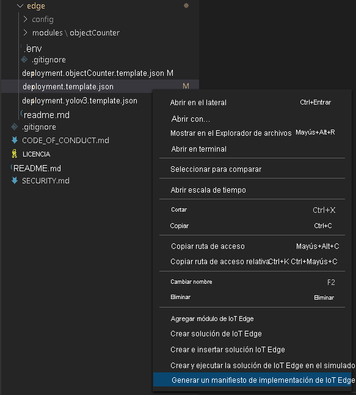
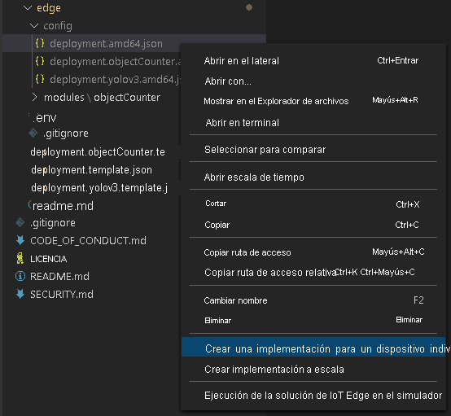

El manifiesto de implementación define los módulos que se implementan en un dispositivo perimetral. También define los valores de configuración de los módulos. 

Siga estos pasos para generar el manifiesto a partir del archivo de plantilla y, después, impleméntelo en el dispositivo perimetral.

1. Abra Visual Studio Code.
1. Al lado del panel **AZURE IOT HUB**, seleccione el icono **Más acciones** para establecer la cadena de conexión de IoT Hub. Puede copiar la cadena del archivo *src/cloud-to-device-console-app/appsettings.json*. 

    

> [!NOTE]
> Es posible que se le pida que proporcione información del punto de conexión integrado de IoT Hub. Para obtener esa información, en Azure Portal, vaya a su centro de IoT y busque la opción **Puntos de conexión integrados** en el panel de navegación izquierdo. Haga clic ahí y busque el **punto de conexión compatible con el centro de eventos** en la sección **Punto de conexión compatible con el centro de eventos**. Copie y use el texto del cuadro. El punto de conexión será similar a este:  
    ```
    Endpoint=sb://iothub-ns-xxx.servicebus.windows.net/;SharedAccessKeyName=iothubowner;SharedAccessKey=XXX;EntityPath=<IoT Hub name>
    ```

1. Haga clic con el botón derecho en **src/edge/deployment.template.json** y seleccione **Generate IoT Edge Deployment Manifest** (Generar manifiesto de implementación de IoT Edge).

    

    Esta acción debe crear un archivo de manifiesto llamado *deployment.amd64.json* en la carpeta *src/edge/config llamado*.
1. Haga clic con el botón derecho en **src/edge/config/deployment.amd64.json**, seleccione **Create Deployment for Single Device** (Crear una implementación para un dispositivo individual) y seleccione el nombre del dispositivo perimetral.

    

1. Cuando se le pida que seleccione un dispositivo IoT Hub, elija **lva-sample-device** en el menú contextual.
1. Tras aproximadamente 30 segundos, en la esquina inferior izquierda de la ventana, actualice Azure IoT Hub. El dispositivo perimetral ahora muestra los siguientes módulos implementados:

    * Live Video Analytics on IoT Edge (nombre del módulo `lvaEdge`).
    * Simulador del Protocolo de transmisión en tiempo real (RTSP) (nombre del módulo `rtspsim`)

El módulo del simulador de RTSP simula una secuencia de vídeo en directo mediante un archivo de vídeo que se copió en el dispositivo perimetral al ejecutar el [script de configuración de recursos de Live Video Analytics](https://github.com/Azure/live-video-analytics/tree/master/edge/setup). 

> [!NOTE]
> Si usa su propio dispositivo perimetral en lugar del proporcionado por el script de instalación, vaya al dispositivo perimetral y ejecute los siguientes comandos con **derechos de administrador**, para extraer y almacenar el archivo de vídeo de ejemplo que se usa para este inicio rápido:  

```
mkdir /home/lvaedgeuser/samples      
mkdir /home/lvaedgeuser/samples/input    
curl https://lvamedia.blob.core.windows.net/public/camera-300s.mkv > /home/lvaedgeuser/samples/input/camera-300s.mkv  
chown -R lvalvaedgeuser:localusergroup /home/lvaedgeuser/samples/  
```
En esta fase se implementan los módulos, pero no hay grafos multimedia activos.
