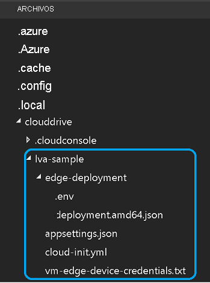

Este tutorial requiere los siguientes recursos de Azure:

* IoT Hub
* Cuenta de almacenamiento
* Cuenta de Azure Media Services
* Máquina virtual Linux en Azure, con el [entorno de ejecución de Azure IoT Edge](../../../../../iot-edge/how-to-install-iot-edge.md) instalado

Para este inicio rápido, se recomienda usar el [script de configuración de recursos de Live Video Analytics](https://github.com/Azure/live-video-analytics/tree/master/edge/setup) para implementar los recursos necesarios en su suscripción de Azure. Para hacerlo, siga estos pasos:

1. Abra [Azure Cloud Shell](https://ms.portal.azure.com/#cloudshell/).
    > [!div class="mx-imgBorder"]
    > :::image type="content" source="../../../media/quickstarts/cloud-shell.png" alt-text="Cloud Shell":::
1. Si es la primera vez que usa Cloud Shell, se le pedirá que seleccione una suscripción para crear una cuenta de almacenamiento y un recurso compartido de Microsoft Azure Files. Seleccione **Create storage** (Crear almacenamiento) para crear una cuenta de almacenamiento para la información de la sesión de Cloud Shell. Esta cuenta de almacenamiento es independiente de la que creará el script para usarla con su cuenta de Azure Media Services.
1. En el menú desplegable del lado izquierdo de la ventana de Cloud Shell, seleccione el entorno **Bash**.

    
1. Ejecute el siguiente comando.

    ```
    bash -c "$(curl -sL https://aka.ms/lva-edge/setup-resources-for-samples)"
    ```
    
    Tras completar correctamente el script, debería ver todos los recursos necesarios en la suscripción. El script configurará 12 recursos en total:
    1. **Punto de conexión de streaming**: este recurso le ayudará a reproducir el activo AMS grabado.
    1. **Máquina virtual**: es una máquina virtual que funcionará como dispositivo perimetral.
    1. **Disco**: se trata de un disco de almacenamiento que se conecta a la máquina virtual para almacenar elementos multimedia y artefactos.
    1. **Grupo de seguridad de red**: se usa para filtrar el tráfico de red hacia y desde los recursos de Azure en una red virtual de Azure.
    1. **Interfaz de red**: permite que una máquina virtual de Azure se comunique con recursos de Internet o Azure, entre otros.
    1. **Conexión bastión**: le permite conectarse a la máquina virtual mediante el explorador y Azure Portal.
    1. **Dirección IP pública**: facilita la comunicación de los recursos de Azure con los servicios de Azure orientados al público y a Internet.
    1. **Red virtual**: hace posible que muchos tipos de recursos de Azure, como las máquinas virtuales, se comuniquen de forma segura entre sí, con Internet y con las redes locales. Obtenga más información sobre las [redes virtuales](https://docs.microsoft.com/azure/virtual-network/virtual-networks-overview)
    1. **IoT Hub**: funciona como un centro de mensajes común para la comunicación bidireccional entre la aplicación de IoT, los módulos de IoT Edge y los dispositivos que administra.
    1. **Cuenta de Media Services**: ayuda a administrar y transmitir contenido multimedia en Azure.
    1. **Cuenta de almacenamiento**: debe tener una cuenta de almacenamiento principal y puede tener cualquier número de cuentas de almacenamiento secundarias asociadas a la cuenta de Media Services. Para más información, consulte [Cuentas de Azure Storage con cuentas de Azure Media Services](https://docs.microsoft.com/azure/media-services/latest/storage-account-concept).
    1. **Registro de contenedor**: ayuda a almacenar y administrar las imágenes privadas del contenedor de Docker y los artefactos relacionados.
1. Después de que finalice el script, seleccione las llaves para exponer la estructura de carpetas. Verá algunos archivos en el directorio *~/clouddrive/lva-sample*. Archivos de interés en este inicio rápido:

     * ***~/clouddrive/lva-sample/edge-deployment/.env***: este archivo contiene las propiedades que utiliza Visual Studio Code para implementar módulos en un dispositivo perimetral.
     * ***~/clouddrive/lva-sample/appsetting.json***: Visual Studio Code utiliza este archivo para ejecutar el código de ejemplo.
     
    Necesitará estos archivos al configurar el entorno de desarrollo en Visual Studio Code en la sección siguiente. Es posible que desee copiarlos en un archivo local por el momento.
    
    

> [!TIP]
> Si tiene problemas con los recursos de Azure que se crean, consulte la **[guía de solución de problemas](../../../troubleshoot-how-to.md#common-error-resolutions)** para resolver algunos de los problemas más comunes que pueden surgir.