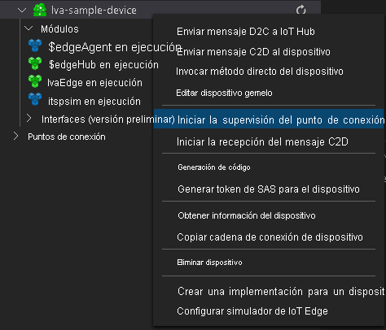

Asegúrese de que haya completado los pasos de [preparación de la supervisión de eventos](../../../detect-motion-emit-events-quickstart.md#prepare-to-monitor-events).



> [!NOTE]
> Es posible que se le pida que proporcione información del punto de conexión integrado del centro de IoT. Para obtener esa información, en Azure Portal, vaya a su centro de IoT y busque la opción **Puntos de conexión integrados** en el panel de navegación izquierdo. Haga clic ahí y busque el **punto de conexión compatible con el centro de eventos** en la sección **Punto de conexión compatible con el centro de eventos**. Copie y use el texto del cuadro. El punto de conexión será similar a este:  
    ```
    Endpoint=sb://iothub-ns-xxx.servicebus.windows.net/;SharedAccessKeyName=iothubowner;SharedAccessKey=XXX;EntityPath=<IoT Hub name>
    ```
