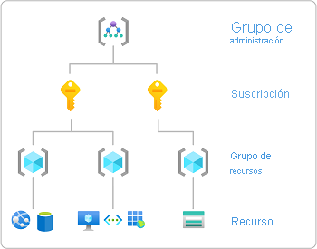
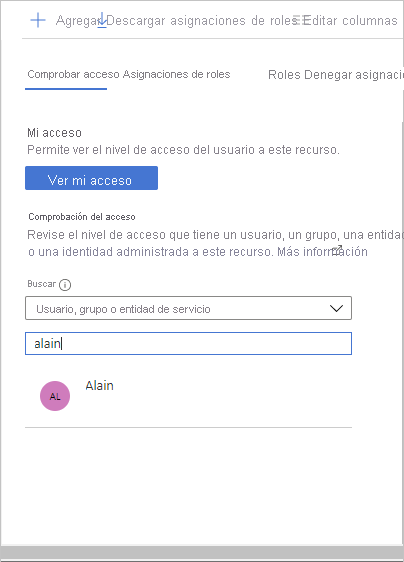

# Inicio rápido: Comprobación del acceso de un usuario a los recursos de Azure

A veces, necesita comprobar qué acceso tiene un usuario a un conjunto de recursos de Azure. Para realizar dicha comprobación, debe enumerar sus asignaciones. Una forma rápida de comprobar el acceso de un usuario es utilizar la característica **Comprobar acceso** de la página **Control de acceso (IAM)** .

## Paso 1: Apertura de los recursos de Azure

Para comprobar el acceso de un usuario, primero debe abrir los recursos de Azure cuyo acceso desee comprobar. Los recursos de Azure se organizan en niveles, que normalmente se denominan el *ámbito*. En Azure, puede especificar un ámbito a cuatro niveles, de ancho a estrecho: grupo de administración, suscripción, grupo de recursos y recurso.

Siga estos pasos para abrir el conjunto de recursos de Azure para el que desea comprobar el acceso.

1. Abra [Azure Portal](https://portal.azure.com).

1. Abra el conjunto de recursos de Azure, como **Grupos de administración**, **Suscripciones**, **Grupos de recursos** o un recurso concreto.

1. Haga clic en el recurso específico de ese ámbito.

    A continuación se muestra un grupo de recursos de ejemplo.

    

## Paso 2: Comprobación de acceso de un usuario

Siga estos pasos para comprobar el acceso de un solo usuario, grupo, entidad de servicio o identidad administrada a los recursos de Azure seleccionados anteriormente.

1. Haga clic en **Control de acceso (IAM).**

    A continuación se muestra un ejemplo de la página Control de acceso (IAM) de un grupo de recursos.

    

1. En la pestaña **Comprobar acceso** de la lista **Buscar**, seleccione el usuario, el grupo, la entidad de servicio o la identidad administrada para los que desea comprobar el acceso.

1. En el cuadro de búsqueda, escriba una cadena para buscar nombres para mostrar, direcciones de correo electrónico o identificadores de objeto en el directorio.

    

1. Haga clic en la entidad de seguridad para abrir el panel **Asignaciones**.

    En este panel, puede ver el acceso para la entidad de seguridad seleccionada en este ámbito y heredada a este ámbito. No se muestran las asignaciones en ámbitos secundarios. Aparecerán las siguientes asignaciones:

    - Asignaciones de roles agregadas con Azure RBAC.
    - Asignaciones de denegación agregadas mediante Azure Blueprints o aplicaciones administradas de Azure.
    - Asignaciones de coadministradores y administradores de servicios clásicos para implementaciones clásicas. 

    

## Paso 3: Compruebe el acceso

Siga estos pasos para comprobar el acceso a los recursos de Azure seleccionados anteriormente.

1. Haga clic en **Control de acceso (IAM).**

1. En la pestaña **Comprobar acceso**, haga clic en el botón **View my access** (Ver mi acceso).

    Aparece un panel de asignaciones que enumera el acceso a este ámbito y heredado en este ámbito. No se muestran las asignaciones en ámbitos secundarios.

    

## Pasos siguientes

> [!div class="nextstepaction"]
> [Enumeración de asignaciones de roles de Azure mediante Azure Portal](role-assignments-list-portal.md)
