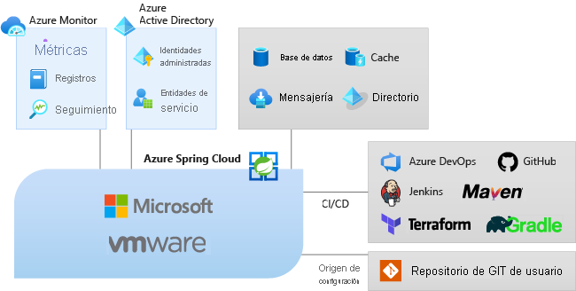

# ¿Qué es Azure Spring Cloud?

Azure Spring Cloud facilita la implementación de aplicaciones de microservicio de Spring Boot en Azure sin necesidad de realizar cambios en el código.  El servicio administra la infraestructura de las aplicaciones de Spring Cloud, con el fin de que los desarrolladores puedan centrarse en el código.  Azure Spring Cloud proporciona administración del ciclo de vida mediante el uso de una supervisión y un diagnóstico completos, administración de la configuración, detección de servicios, integración de CI/CD e implementaciones blue-green, entre otros.

## Razones para usar Azure Spring Cloud

La implementación de aplicaciones en Azure Spring Cloud tiene muchas ventajas.  Puede:
* Migrar de forma eficaz las aplicaciones Spring existentes y administrar los costos y el escalado en la nube.
* Modernizar las aplicaciones con patrones de Spring Cloud para mejorar la agilidad y la velocidad de entrega.
* Ejecutar Java a escala en la nube e impulsar un mayor uso sin una infraestructura complicada.
* Desarrollar e implementar rápidamente sin dependencias de la contenedorización.
* Supervisar las cargas de trabajo de producción de forma eficaz y sin esfuerzo.

Azure Spring Cloud es compatible con aplicaciones de [Spring Boot](https://spring.io/projects/spring-boot) para Java y de [Steeltoe](https://steeltoe.io/) para ASP.NET Core. Steeltoe se ofrece actualmente como versión preliminar pública. Las ofertas de versión preliminar pública le permiten experimentar con nuevas características antes de su publicación oficial. Los servicios y las características en versión preliminar pública no están diseñados para su uso en producción. Para obtener más información, consulte las [preguntas frecuentes](https://azure.microsoft.com/support/faq/) o envía una [solicitud de soporte técnico](../azure-portal/supportability/how-to-create-azure-support-request.md).

## Introducción al servicio

Al formar parte del ecosistema de Azure, Azure Spring Cloud facilita el enlace con otros servicios de Azure, como almacenamiento, bases de datos, supervisión, etc.  

  

* Azure Spring Cloud es un servicio totalmente administrado para aplicaciones de Spring Boot que le permite centrarse en la creación y ejecución de aplicaciones sin la molestia de administrar la infraestructura.

* No tiene más que implementar los archivos JAR o el código, y Azure Spring Cloud conectará automáticamente sus aplicaciones con el runtime del servicio Spring y el ciclo de vida de la aplicación integrada.

* La supervisión es simple. Después de la implementación puede supervisar el rendimiento de la aplicación, corregir los errores y mejorar rápidamente las aplicaciones. 

* Integración completa con los servicios y ecosistemas de Azure.

* Azure Spring Cloud está preparado para la empresa y tiene una infraestructura totalmente administrada, administración del ciclo de vida integrada y es fácil de supervisar.

## Introducción a la documentación
En esta documentación se incluyen secciones en las que se explica no solo cómo empezar a usar los servicios de Azure Spring Cloud, sino también cómo sacar provecho de ellos.

* Primeros pasos
    * [Inicio de la primera aplicación](spring-cloud-quickstart.md)
    * [Aprovisionamiento de un servicio de Azure Spring Cloud](spring-cloud-quickstart-provision-service-instance.md)
    * [Configuración del servidor de configuración]()
    * [Compilación e implementación de aplicaciones](spring-cloud-quickstart-deploy-apps.md)
    * [Uso de registros, métricas y seguimiento](spring-cloud-quickstart-logs-metrics-tracing.md)
* Instrucciones
    * [Desarrollo](how-to-prepare-app-deployment.md): Prepare una aplicación de Java Spring existente para su implementación en Azure Spring Cloud. Si se configura correctamente, Azure Spring Cloud proporciona servicios sólidos para supervisar, escalar y actualizar aplicaciones de Java Spring Cloud.
    * [Implementación](spring-cloud-howto-staging-environment.md): Cómo configurar una implementación de almacenamiento provisional con el patrón de implementación blue-green en Azure Spring Cloud. La implementación azul/verde es un patrón de entrega continua de Azure DevOps que se basa en mantener una versión existente (azul) activa mientras se implementa una nueva (verde).
    * [Configuración de aplicaciones](spring-cloud-howto-start-stop-delete.md):  inicie, detenga y elimine de aplicaciones de Azure Spring Cloud. Cambie el estado de una aplicación en Azure Spring Cloud mediante Azure Portal o la CLI de Azure.
    * [Escala](spring-cloud-howto-scale-manual.md): escale cualquier aplicación de microservicios desde el panel de Azure Spring Cloud de Azure Portal o mediante la configuración de la escalabilidad automática. Hay direcciones IP públicas disponibles para comunicarse con recursos externos, como las bases de datos, el almacenamiento y los almacenes de claves.
    * [Supervisión de aplicaciones](spring-cloud-howto-distributed-tracing.md): herramientas de seguimiento distribuido para depurar y supervisar fácilmente problemas complejos. Azure Spring Cloud integra Spring Cloud Sleuth con Application Insights de Azure. Esta integración proporciona una funcionalidad eficaz de seguimiento distribuido desde Azure Portal.
    * [Protección de aplicaciones](spring-cloud-howto-enable-system-assigned-managed-identity.md): los recursos de Azure proporcionan una identidad administrada automáticamente en Azure Active Directory. Puede usar esta identidad para autenticar a cualquier servicio que admita la autenticación de Azure AD, sin necesidad de tener credenciales en el código.
    * [Integración con otros servicios de Azure](spring-cloud-howto-bind-cosmos.md): en lugar de configurar manualmente las aplicaciones de Spring Boot, puede enlazar automáticamente determinados servicios de Azure a sus aplicaciones, por ejemplo, puede enlazar una aplicación a una base de datos de Azure Cosmos DB.
    * [Automatización](spring-cloud-howto-cicd.md): Las herramientas de integración continua y entrega continua permiten implementar rápidamente las actualizaciones en las aplicaciones existentes con el mínimo esfuerzo y riesgo. Azure DevOps ayuda a organizar y controlar estas tareas clave. 
    * [Solución de problemas](spring-cloud-howto-self-diagnose-solve.md): los diagnósticos de Azure Spring Cloud proporcionan una experiencia interactiva que sirve de ayuda para solucionar problemas de las aplicaciones. No se requiere ninguna configuración. Cuando encuentre problemas, el diagnóstico de Azure Spring Cloud los identifica y le guía por la información que ayuda a solucionarlos.
    * [Migración](/azure/developer/java/migration/migrate-spring-boot-to-azure-spring-cloud): Cómo migrar una aplicación de Spring Cloud o de Spring Boot existente para ejecutarse en Azure Spring Cloud.

 Para empezar, consulte:

> [!div class="nextstepaction"]
> [Inicio rápido de Spring Cloud](spring-cloud-quickstart.md)

Los ejemplos están disponibles en GitHub: [Ejemplos de Azure Spring Cloud](https://github.com/Azure-Samples/Azure-Spring-Cloud-Samples/tree/master/).