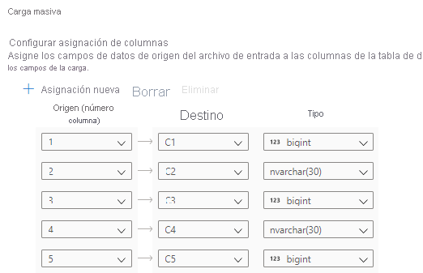

# Inicio rápido: Carga masiva con Synapse Studio

La carga de datos es sencilla con el Asistente para la carga masiva en Synapse Studio. Synapse Studio es una característica de Azure Synapse Analytics. El Asistente para carga masiva le guía a través de la creación de un script de T-SQL con la [instrucción COPY](/sql/t-sql/statements/copy-into-transact-sql?view=azure-sqldw-latest&preserve-view=true) para cargar datos de forma masiva en un grupo de SQL dedicado. 

## Puntos de entrada al Asistente para carga masiva

Para realizar una carga masiva de datos puede hacer clic con el botón derecho en la siguiente área de Synapse Studio: un archivo o una carpeta de una cuenta de Azure Storage que está asociada al área de trabajo.

## Prerrequisitos

- El asistente genera una instrucción COPY, que usa el tránsito de Azure Active Directory para la autenticación. El [usuario de Azure AD debe tener acceso](./sql-data-warehouse/quickstart-bulk-load-copy-tsql-examples.md#d-azure-active-directory-authentication) al área de trabajo con, al menos, el rol de Azure Colaborador de datos de Storage Blob en la cuenta de Azure Data Lake Storage Gen2. 

- Si se va a crear una tabla para cargar los datos, es preciso tener los [permisos necesarios para usar la instrucción COPY](/sql/t-sql/statements/copy-into-transact-sql?view=azure-sqldw-latest&preserve-view=true#permissions) y tener permisos de creación de tablas.

- El servicio vinculado asociado a la cuenta de Azure Data Lake Storage Gen2 *debe tener acceso al archivo o carpeta* que se va a cargar. Por ejemplo, si el mecanismo de autenticación del servicio vinculado es una identidad administrada, la identidad administrada del área de trabajo debe tener, como mínimo, permiso de lectura de datos de Blob Storage en la cuenta de almacenamiento.

- Si hay una red virtual habilitada en el área de trabajo, asegúrese de que el entorno de ejecución integrado asociado a los servicios vinculados de la cuenta de Azure Data Lake Storage Gen2 para los datos de origen y la ubicación del archivo de error tiene habilitada la creación interactiva. La creación interactiva es necesaria para la detección automática de esquemas, la vista previa del contenido del archivo de origen y la exploración de cuentas de almacenamiento de Azure Data Lake Storage Gen2 en el asistente.

## Pasos

1. En el panel **Source storage location** (Ubicación de almacenamiento de origen), seleccione la cuenta de almacenamiento y el archivo o la carpeta desde los que se va a realizar la carga. El asistente intenta detectar automáticamente tanto archivos de Parquet como archivos de texto delimitado (CSV), lo que incluye la asignación de los campos de origen del archivo a los tipos de datos de SQL de destino adecuados. 

   

2. Seleccione la configuración del formato de archivo, lo que incluye la configuración de los errores, para cuando haya filas rechazadas en el proceso de carga masiva. También puede seleccionar **Vista previa de los datos** para ver la forma en que la instrucción COPY analizará el archivo para ayudarle en la configuración del formato de archivo. Seleccione **Vista previa de los datos** cada vez que cambie la configuración del formato de archivo para ver cómo va a analizar el archivo la instrucción COPY con la configuración actualizada.

    

   > [!NOTE]  
   >
   > - El Asistente para carga masiva no admite la vista previa de datos con terminadores de campo de varios caracteres. Si se especifica uno de estos terminadores, el asistente mostrará una vista previa de los datos de una sola columna. 
   > - Si se selecciona **Infer column names** (Inferir nombres de columna), el Asistente para carga masiva analizará los nombres de las columnas de la primera fila especificada por el campo **First row** (Primera fila). El Asistente para carga masiva incrementará automáticamente en 1 el valor de `FIRSTROW` en la instrucción COPY para omitir esta fila de encabezado. 
   > - En la instrucción COPY se admite la especificación de terminadores de fila de varios caracteres. Sin embargo, el Asistente para carga masiva no lo admite, por lo que se producirá un error.

3. Seleccione el grupo de SQL dedicado que va a usar para realizar la carga, incluido si la carga será en una tabla existente o en una nueva.
   .
4. Seleccione **Configure column mapping** (Configurar asignación de columnas) para asegurarse de que tiene la asignación de columnas adecuada. Tenga en cuenta que los nombres de las columnas se detectarán automáticamente si se ha habilitado **Infer column names** (Inferir nombres de columna). En el caso de las nuevas tablas, la configuración de la asignación de columnas es fundamental para actualizar los tipos de datos de la columna de destino.

   
5. Seleccione **Open script** (Abrir script). Se genera un script de T-SQL con la instrucción COPY para realizar la carga desde un lago de datos.
   

## Pasos siguientes

- Consulte el artículo [Instrucción COPY](/sql/t-sql/statements/copy-into-transact-sql?view=azure-sqldw-latest&preserve-view=true#syntax) para más información sobre las funcionalidades de COPY.
- Consulte la [información general sobre la carga de datos](./sql-data-warehouse/design-elt-data-loading.md#what-is-elt) para obtener información sobre el uso de un proceso de extracción, transformación y carga (ETL).
